# UCM(Panabit+UCM+Panalog)设计文档 

#### 修订记录

修改记录累积了每次文档更新的说明。最新版本的文档包含以前所有文档版本的更新内容。

| 文档版本 | 修订人     | 修改日期   |
| -------- | ---------- | ---------- |
| v01      | 第一次发布 | 2019-10-31 |

#### 说明

| 章节                                                | 作者                     |
| --------------------------------------------------- | ------------------------ |
| 1 需求概述                                          | 郑琴、赵翠娜、吴迪、朱涛 |
| 2 本功能涉及的UCM功能模块                           | 郑琴                     |
| 3 设计思路                                          | 郑琴                     |
| 4 接口说明                                          | 郑琴 朱涛                |
| 5 各功能具体实现                                    |                          |
| 5.1-5.3 防火墙 接口配置 弹窗限制                    | 郑琴                     |
| 5.4-5.5 用户组 QoS                                  | 赵翠娜                   |
| 5.6-5.9 账号管理 密码重置 用户流量查询 网关链路查询 | 吴迪                     |
| 5.10-5.12 设备状态 接口查询 链路策略                | 朱涛                     |
| 5.13 一键同步                                       | 赵翠娜                   |


## 1.需求简述

本次功能的需求为通过UCM对网关（panabit）和radius进行数据配置和查询，具体为：

- 查询panalog获取所有网关信息（包括网关编号、名称、状态、流量等）并在UCM的页面上显示；

- 需要支持针对目的IP地址和端口的黑白名单，禁止用户访问这些IP和端口；

- 禁止外部网络访问某些内部IP和端口，或者禁止使用某种不安全的通信协议；

- 需要支持浏览器弹窗屏蔽功能，支持针对特定url的弹窗屏蔽功能；

- 需要支持LAN口和WAN口的MTU可配置；

- 查询LAN口和WAN口的信息（包括接口名称、网卡、MTU、VLAN等）在UCM上显示；

- 查询链路策略信息（包括用户组、源接口、目的接口、协议、应用、目标线路等）在UCM上显示；

- 基于用户组，创建用户账号。在用户组的上网行为管理的基础上，再对规定用户的流量和时长做登录限制；

- 对用户账号的密码进行重置；

- 查询用户流量使用信息

- 查询在线网关的链路的状态和流入流出情况

- 支持配置不同的上网行为模板，例如A用户只能发邮件、打电话，B用户可以访问网页，不能看视频，C用户无限制；

- 支持数据流双向限速；

- 支持基于TCP、UDP的Session数限制；

- 支持对同一时间上网用户Session总数进行限制。

- 支持一键部署功能，对新上线网关同步所有已有部署

  

## 2.本功能涉及的UCM功能模块

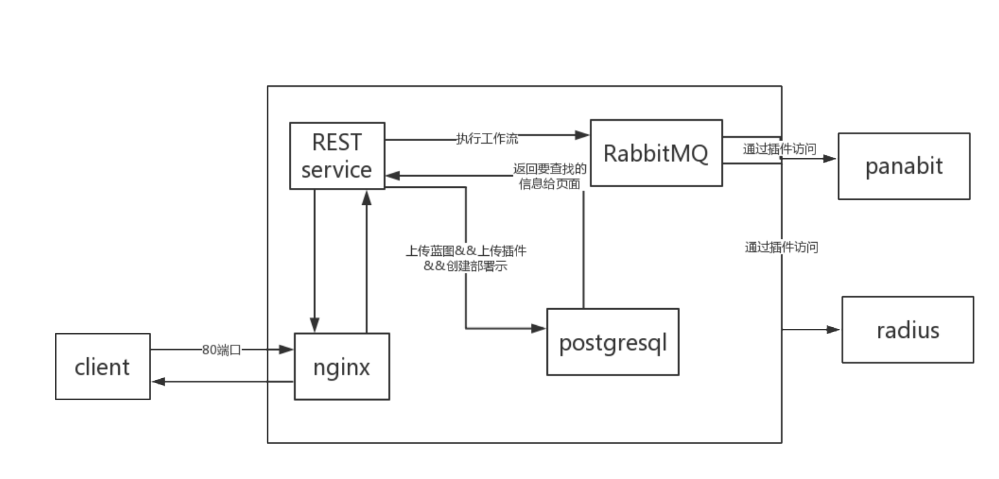

​      

| 模块名称     | 功能                                               |
| ------------ | -------------------------------------------------- |
| client       | 客户端，通过80端口访问UCM manager                  |
| nginx        | 反向代理，将页面的请求转发到manager的REST service  |
| REST service | 提供访问数据库的REST API                           |
| postgresql   | 一种关系数据库，存储蓝图、插件、部署等数据         |
| RabbitMQ     | manager的消息队列                                  |
| panabit      | 一种综合应用网关，具有路由、负载均衡、防火墙等功能 |
| radius       | 远程用户拨号认证系统，处理用户认证、计费等功能     |

 

## 3.设计思路 

​	 本次功能的需求，基本可以区分为采用UCM对panabit和radius进行数据配置和数据查询两种功能。功能实现基于UCM的现有架构，每个需求定义特定的蓝图进行部署，执行部署工作流时通过插件接口访问panabit和radius，并将从panabit和radius获取的数据写入UCM的数据库。UCM的页面通过REST接口访问数据库，将从数据库提取的数据显示在页面上。

​      因此每个功能要实现的内容包括以下：

​      1）定义插件接口（plugin.yaml），基于插件接口设计每个功能的蓝图，定义蓝图的输入；

​      2）设计数据表，存储插件从panabit和radius获取的数据；

​      3）编写插件接口代码，调用公共接口（从panalog获取所有网关信息）获取网关的ip:port、cookie等信息，通过REST接口访问网关，执行配置或查询操作；

​      4）基于数据表，定义manager的REST接口；

​      5）修改nginx的配置，将步骤4的访问路径加入

​      6）创建widget，通过fetchUrl或者fetchData获取数并显示。


## 4.接口说明

### 4.1 UCM的REST接口

页面widget通过REST接口访问UCM数据库，当前功能仅需要用到GET方法获取数据库记录做显示。以防火墙功能为例，widget通过fetchUrl或者fetchData来获取数据

```
fetchUrl:'[manager]/firewall[params]',
```

```
fetchData(widget,toolbox,params) {    
    return toolbox.getManager().doGet('/firewall',params)

```

manager的REST需要创建数据模型，并提供get方法

```
class Firewall(SecuredResource):
        @swagger.operation(responseClass='List[{0}]'.format(models.Firewall.__name__))
        @rest_decorators.exceptions_handled
        @rest_decorators.marshal_with(models.Firewall)
        @rest_decorators.create_filters(models.Firewall)
        @rest_decorators.paginate
        @rest_decorators.sortable(models.Firewall)
        @rest_decorators.all_tenants
        @rest_decorators.search('policy_number')
        def get(self, _include=None, filters=None, pagination=None, sort=None,
                all_tenants=None, search=None, **kwargs):
            """
            List All firewall policy
            """
            return get_storage_manager().list(
                models.Firewall,
                include=_include,
                filters=filters,
                substr_filters=search,
                pagination=pagination,
                sort=sort,
                all_tenants=all_tenants,
            )
  参数：
	pagination,分页
	filter，过滤
	sort，排序
	_include，包含字段
	all_tenants,所有租户，
	search，查询
```

其他功能同防火墙类似，不再详述。

### 4.2 panalog接口

UCM执行部署的时候要从panalog获取当前所有网关及网关状态。

panalog上的网关状态只有在线和离线两个状态，UCM上的网关状态分为“online” “adopting” 和“offline” 三个状态，初始从panalog获取的上线网关为“adopting” ，执行一键同步后变成“online” ，初始从panalog获取的离线网关为“offline”，所有“online”和“adopting”状态的网关获取cookies失败后也会更新网关为“offline”。

根据功能要求，panalog接口需要满足以下要求

- 所有新增配置和查询的部署在执行时需要获取所有“online”的网关进行处理

- 一键部署功能执行时需要获取所有 “adopting”状态的网关进行处理

基于以上要求，设计接口如下：

#### **4.2.1 get_online_gateway**

```
功能：获取所有状态为“online”的网关
入参：无
出参：无
返回值：一个在线网关的网关Id，ip，端口号，cookies组成的生成器，       
	如果获取cookies失败则更新该在线网关为离线；
```

#### 4.2.2 get_adopting_gateway

```
功能：用来获取所有状态为“adopting”的网关
入参：无
出参：无
返回值：一个上线中的网关的网关Id，ip，端口号，cookies组成的生成器，        
	如果获取cookies失败则更新该上线中的网关为离线；
```

### 4.3 panabit接口

以address_pool为例，panabit接口的数据类型定义如下：

其中

- derived_from：继承类型，所有都一样cloudify.nodes.Root
- properties：panabit上地址池的属性字段，description为参数描述，type是参数类型，required表示是否必须，蓝图上
- interfaces：各个操作对应的函数接口，目前基本就create和delete两个操作，以本例来说create对应的函数接口函数为pa.pa_plugin_task.address_pool.create（文件address_pool.py中的create（）函数），输入为用户输入

```
    cloudify.pa.address_pool:
        derived_from: cloudify.nodes.Root
        properties:
            user_group_name:
                description: >
                    name of the address_pool
                type: string
                required: true
            start_ip:
                description: >
                    the start ip for the address_pool range
                type: string
                required: false
            final_ip:
                description: >
                    the final ip for the address_pool range
                type: string
                required: false
            max_uplink_rate:
                description: >
                  Maximum uplink rate for users
                type: string
                required: false
            max_downlink_rate:
                description: >
                  Maximum downlink rate for users
                type: string
                required: false
            dns_server:
                description: >
                    e.g: '114.114.114.114,8.8.8.8'
                type: string
                default: '114.114.114.114,8.8.8.8'
                required: false
            max_online_time:
                description: >
                  When the online time exceeds, 
                  the system will actively kick the user offline,
                  0 means no control
                type: string
                required: false
            allow_for_overdue_account:
                description: >
                    whether the Pppoe client can use the overdue account
                    valid value are:
                    *pass
                    *reject
                type: string
                required: false
            dialing_interface:
                description: >
                    Generation of dial control
                type: string
                required: false
            applist:
                description: >
                    Permitted user's online behavior
                type: string
                required: false
            group_en_name:
                description: >
                     English name of the protocol group
                type: string
                required: false
        interfaces:
            cloudify.interfaces.lifecycle:
                create:
                    implementation: pa.pa_plugin_task.address_pool.create
                    inputs: {}
                delete:
                    implementation: pa.pa_plugin_task.address_pool.delete
                    inputs: {}
```

其他类型同理，由于类型较多，此处不再列出，具体可看

<http://192.168.4.221:30000/zhaocuina/panabit_plugin/blob/master/pa_plugin/plugin.yaml>

#### 4.3.1 流量控制Panabit接口

防火墙、qos和用户组都会操作panabit的【策略管理】-【流量控制】，因此提供流量控制公共接口如下：

##### flow_control_create

```
功能：用来向panabit增加流量控制策略
入参：ctx：蓝图输入, 
    login_ip：REST访问panabit的IP端口, 
    cookie_jar：REST访问panabit的cookies,
    polno：策略编号，qos从2048开始，用户组从4096开始，防火墙从32768开始
出参：无
返回值：无
```

##### flow_control_delete

```
功能：用来向panabi删除流量控制策略
入参：login_ip：REST访问panabit的IP端口, 
     cookie_jar：REST访问panabit的cookies,
     policy_number：策略编号，qos从2048开始，用户组从4096开始，防火墙从32768开始
出参：无
返回值：无
```


## 5.各功能的具体实现

### 5.1防火墙

​		防火墙包括了需求列表中的的黑白名单和防火墙功能，基于需求，定义防火墙的策略字段包括策略编号、内网IP、内网端口、外网IP、外网端口、协议、方向（上行/下行）、动作（允许/禁止），对应的是panabit的【策略管理】中的【流量控制】。

​        执行部署的时候先访问panalog获取所有状态为“online”的网关，然后逐个取获取的网关访问（panabit），通过POST方法将以上配置的内容发送到panabit，并写UCM数据库。

#### 5.1.1蓝图

<http://192.168.4.221:30000/zhaocuina/panabit_plugin/blob/master/related_blueprints/bp_firewall.yaml>

#### 5.1.2数据表

表名：firewall

| 字段名称      | 字段说明                 |
| ------------- | ------------------------ |
| policy_number | 策略编号，唯一，表关键字 |
| internal_ip   | 内网IP                   |
| internal_port | 内网端口                 |
| external_ip   | 外网IP                   |
| external_port | 外网端口                 |
| protocol      | 协议                     |
| direction     | 方向                     |
| action        | 动作                     |
| gateway_list  | 网关列表                 |

postgresql数据库中创建数据表的命令

create table firewall( _storage_id serial primary key,id text ,visibility visibility_states default 'global',gateway_list text,policy_number integer unique,internal_ip text,internal_port text,internet_ip text,internet_port text,direction text,protocol text,actions text, _tenant_id  text default '0',
 _creator_id  text default '0');

alter table firewall OWNER TO cloudify;

#### 5.1.3panabit插件接口

1）增加接口create，用于配置防火墙策略

```
def create(**kwargs):
    L = []
    gateway_list = ''
    ctx.logger.info('............start task: start create firewall policy............')
    polno = ctx.node.properties['policy_number']//获取参数"策略编号"的值，并校验合法性1-1000
    if int(polno) > 1000 or int(polno) == 0:
        raise ValueError(
            "range of policy_number is 1-1000."
        )
    gateway_policy_num = str(32767 + int(polno))//防火墙的策略编号从32768开始
    gateway_info = get_online_gateway()//获取在线网关
    if gateway_info:
        while True:
            try:
                T = gateway_info.next()
                ip_port = T[0]
                login_cookie = T[1]
                gateway_number = T[2]
                flow_control_create(ctx, ip_port, login_cookie, gateway_policy_num)//向panabit新增控策略
                login_cookie.clear()
                L.append(gateway_number)
            except:
                break

        gateway_list = ",".join(L)
        ctx.logger.info('gateway_list = %s and policy_number=%s ' % (gateway_list, polno))
    db_update(ctx, gateway_list, polno)//更新UCM数据库
    
```

向panabit新增流控策略的处理逻辑为

```
先获取策略组 
url：'https://' + login_ip +'/cgi-bin/Setup/policy_listtime'
若获取不成功，新增名称为“firewall”的策略组
url：'https://' + login_ip + '/cgi-bin/Setup/policy_addgrp'
post_data = {'grpname': 'firewall'}
获取成功或者新增成功，向panabit新增流控策略
url：'https://' + login_ip + '/cgi-bin/Setup/policy_addrule'
post_data = {'polno': polno, 'desc': desc, 'bridge': bridge,'dir':
             direction,'vlan':vlan,'intype':intype_n,'inipnet':inipnet,'iniprng':iniprng,
             'inport':inport,'outtype':outtype_n,'outipnet':outipnet,'outiprng':outiprng,
             'outport': outport,'proto': proto, 'appid':appid, 'natip':natip, 
              'hasms':hasms, 'qqcnt':qqcnt,'action': action, 'iprate':iprate, 
              'matchact': matchact,'policy':policygrp}
             
```


2）增加接口delete，用于删除防火墙策略，采用get方法，携带参数

```
def delete(**kwargs):
    L = []
    gateway_list=''
    ctx.logger.info('............start task: start delete firewall policy............')
    polno = ctx.node.properties['policy_number'] //获取输入参数中的策略编号
    if int(polno) > 1000 or int(polno) == 0:
        raise ValueError(
            "range of policy_number is 1-1000."
        )
    gateway_policy_num = str(32767 + int(polno)) //panabit中防火墙在流控中的策略编号从32768开始
    gateway_info = get_online_gateway() //获取所有在线网关
    if gateway_info:
        while True:
            try:
                T = gateway_info.next()
                ip_port = T[0]
                login_cookie = T[1]
                gateway_number = T[2]
                ctx.logger.info('ip_port = %s login_cookie=%s gateway_number=%s' % (ip_port,login_cookie,gateway_number))
                flow_control_delete(ip_port, login_cookie, gateway_policy_num) //删除panabit中的流量控制
                login_cookie.clear()
                L.append(gateway_number)
            except:
                break

        gateway_list = ",".join(L)
        ctx.logger.info('gateway_list = %s and polno =%s ' % (gateway_list,polno))
    db_delete_and_set_delopy_tbd(polno,gateway_list) //删除数据库中的记录，若有不在线的网关，更新待删除的编号到网关状态表中
```

向panabit删除流控策略的处理逻辑为

```
 url：为'https://' + login_ip +'/cgi-bin/Setup/policy_getgrp，
 queryparams = {'action': 'rmvrule', 'policy': int(policygrp), 'ruleid': int(policy_number)}
```

#### 5.1.4REST

REST增加表firewall的模型和对应的REST接口

1）文件（modles.py 及resource_models.py），

2）增加firewall表的get方法

具体见4.1节的说明

#### 5.1.5widget

widget的设计如下图

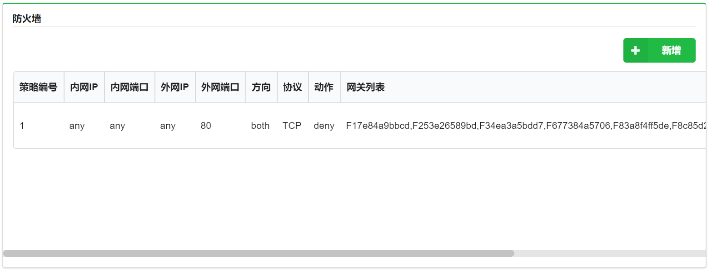

主要展示以下防火墙参数：

- **策略编号**
- **内网IP**
- **内网端口**
- **外网IP**
- **外网端口**
- **协议**
- **方向**
- **操作**
- **网关列表**：配置过的网关列表

根据需求需要提供新增、删除、更新按钮，绑定名字为bp_firewall的蓝图文件：

- **新增**：以firewall+policy_id作为部署名称，新建的时候执行创建部署和执行install工作流两步操作，新建输入参数名称如下：

  **action**：输入permit（允许）或者deny（阻止）

  **external_ip**:外网IP，支持格式xxx.xxx.xxx.xxx/n和xxx.xxx.xxx.xxx-xxx.xxx.xxx.xxx，不区分IP的时候输入any

  **external_port:**外网端口

  **internal_ip:**内网IP，支持格式xxx.xxx.xxx.xxx/n和xxx.xxx.xxx.xxx-xxx.xxx.xxx.xxx，不区分IP的时候输入any

  **internal_port:**内网端口

  **policy_id**:策略编号，参数范围1-1000

  **protocol**:协议，支持UDP、TCP和PPP，不区分协议填写any

  **direction:**方向，支持输入out（上行）、in（下行）和both（双向）

  **关闭弹窗**：输入true（是）或者false（否）分别表示关闭弹窗和不关闭弹窗

- **更新**：修改除“policy_id”外的所有输入参数，policy_id只支持删除后新增

- **删除**：执行uninstall工作流并删除部署

widget参数设置：

- **定时刷新**：关闭
- **分页大小**：5
- **排序**：按照策略编号升序排列

### 5.2接口配置

接口配置即配置WAN口和LAN口的MTU，对应的是panabit的【应用路由】中的【接口线路】的WAN口和LAN口配置中的MTU字段。执行部署时，先获取panabit的WAN口和LAN口数据，再将要配置的信息更新到panabit。

#### 5.2.1蓝图

<http://192.168.4.221:30000/zhaocuina/panabit_plugin/blob/master/related_blueprints/bp_interface_conf.yaml>


#### 5.2.2数据表

表名： wan_interface和lan_interface

表wan_interface

| 字段名称                  | 字段说明                  |
| ------------------------- | ------------------------- |
| number                    | 序号                      |
| line_name                 | 线路名称                  |
| network_card              | 网卡，WAN口关联的网卡名称 |
| state                     | 状态                      |
| ip                        | IP地址                    |
| gateway                   | 网关                      |
| mtu                       | MTU                       |
| vlan                      | VLAN编号                  |
| dns_traction_failure_rate | DNS牵引/失败率            |
| inflow_rate               | 流入速率                  |
| outflow_rate              | 流出速率                  |

表lan_interface

| 字段名称       | 字段说明                  |
| -------------- | ------------------------- |
| number         | 序号                      |
| interface_name | 接口名称                  |
| network_card   | 网卡，WAN口关联的网卡名称 |
| state          | 状态                      |
| ip             | IP地址                    |
| network_mask   | 网络掩码                  |
| mtu            | MTU                       |
| vlan           | VLAN编号                  |
| inflow_rate    | 流入速率                  |
| outflow_rate   | 流出速率                  |

表mtu_conf

| 字段名称 | 字段说明 |
| -------- | -------- |
| id       | 序号     |
| lan_mtu  | LAN口MTU |
| wan_mtu  | WAN口MTU |

postgresql数据库中创建数据表的命令

create table wan_interface(id serial,
number text unique,
line_name  text,
network_card text,
state text,
ip text,
gateway text,
mtu text,
vlan text,
dns_traction_failure_rate text,
inflow_rate text,
outflow_rate text,
connects text,
annotate text,
_storage_id serial primary key,
 _tenant_id  text default '0',
 _creator_id  text default '0',
visibility visibility_state default 'global'
);

#lan_interface_search
create table lan_interface(id serial,
number text unique,
interface_name  text,
network_card text,
state text,
ip text,
network_mask text,
mtu text,
vlan text,
inflow_rate text,
outflow_rate text,
_storage_id serial primary key,
 _tenant_id  text default '0',
 _creator_id  text default '0',
visibility visibility_states default 'global'
);

alter table lan_interface OWNER TO cloudify;

alter table wan_interface OWNER TO cloudify;

#### 5.2.3 panabit插件接口

增加接口update对应create操作，具体逻辑为

```
        interfaces:
            cloudify.interfaces.lifecycle:
                create:
                    implementation: pa.pa_plugin_task.interface_line.update
                    inputs: {}
```


```
def update(**kwargs):
    L=[]
    gateway_list =''
    gateway_info = get_online_gateway() //获取所有在线网关
    if gateway_info:
        while True:
            try:
                T = gateway_info.next()
                ip_port = T[0]
                login_cookie = T[1]
                gateway_number = T[2]
                ctx.logger.info("gateway_number = %s " % (gateway_number))
                interface_line_update(ctx, ip_port, login_cookie)//向panabit更新MTU
                login_cookie.clear()
                L.append(gateway_number)
            except:
                break

        #   insert into DB
        gateway_list = ",".join(L)
    ctx.logger.info("gateway_list = %s " % (gateway_list))
    list = gateway_list.split(',')
    db_update(list)//更新UCM数据库
```

向panabit更新MTU的具体逻辑为

```
先通过GET方法获取WAN口和LAN口的信息，
   WAN口获取url为 https://login_ip/cgi-bin/Route/proxy_list
   LAN口获取url为 https://login_ip/cgi-bin/Route/iflan_list
再通过POST方法更新MTU信息
   WAN口url为https://login_ip/cgi-bin/Route/proxy_edit
   LAN口url为https://login_ip/cgi-bin/Route/iflan_edit
```

更新数据库的逻辑为

```
对于所有配置过的网关，
   循环更新lan_interface和wan_interface表中对应网关的MTU
更新mtu_conf表，一键部署的时候会取此配置进行同步
```


#### 5.2.4 REST

REST增加表 wan_interface和lan_interface的模型和对应的REST接口

1）文件（modles.py 及resource_models.py），

2）增加wan_interface和lan_interface表的get方法

类似4.1接口说明

#### 5.2.5widget

MTU配置只是更新panabit中的WAN口和LAN口的MTU，设计widget的时候直接设计了按钮的方式，点击按钮即为输入参数页面


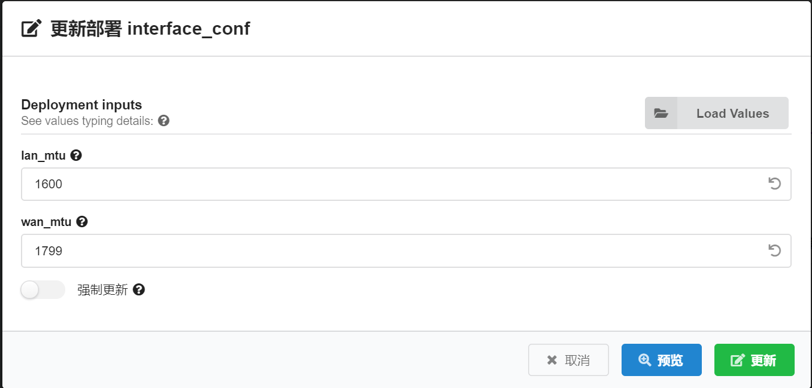

提供按钮更新LAN口和WAN口的MTU：

​	其中LAN口和WAN口参数的显示在接口配置（LAN）和接口配置（WAN）的widget中处理

本按钮绑定名字为interface_conf的部署（对应的蓝图为bp_interface_conf）：

​	输入参数名称如下：

**lan_mtu**:LAN口的MTU,默认1500

**wan_mtu:**WAN口的MTU，默认1500

widget参数设置：

- **定时刷新**：关闭

### 5.3弹窗限制

弹窗限制，panabit暂时不支持。

#### 5.3.1蓝图

<http://192.168.4.221:30000/zhaocuina/panabit_plugin/blob/master/related_blueprints/bp_web_app_firewall.yaml>

#### 5.3.2数据表

表名：web_app_firewall

| 字段名称            | 字段说明                |
| ------------------- | ----------------------- |
| url                 | url，唯一，表关键字     |
| close_popup_windows | 关闭弹窗，True还是False |

postgresql数据库中创建数据表的命令

create table web_app_firewall(id serial, _storage_id serial primary key,visibility visibility_states default 'global',gateway_list text,url text,close_popup_windows text, _tenant_id  text default '0',
 _creator_id  text default '0');

alter table web_app_firewall OWNER TO cloudify;

#### 5.3.3panabit插件接口

1）增加接口create，用于配置弹窗限制，目前panabit不支持，仅写库

2）增加接口delete，用于删除弹窗限制，目前panabit不支持，仅删除库里的记录

#### 5.3.4REST

REST增加表web_app_firewall的模型和对应的REST接口

1）文件（modles.py 及resource_models.py），

2）增加web_app_firewal表的get方法

类似4.1的说明

#### 5.3.5widget

widget的设计如下图

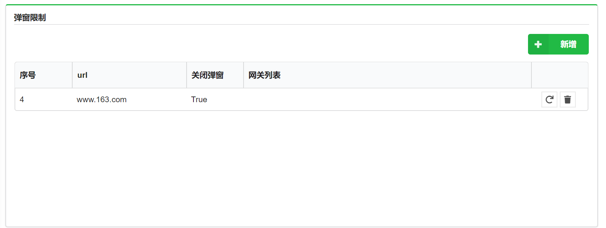

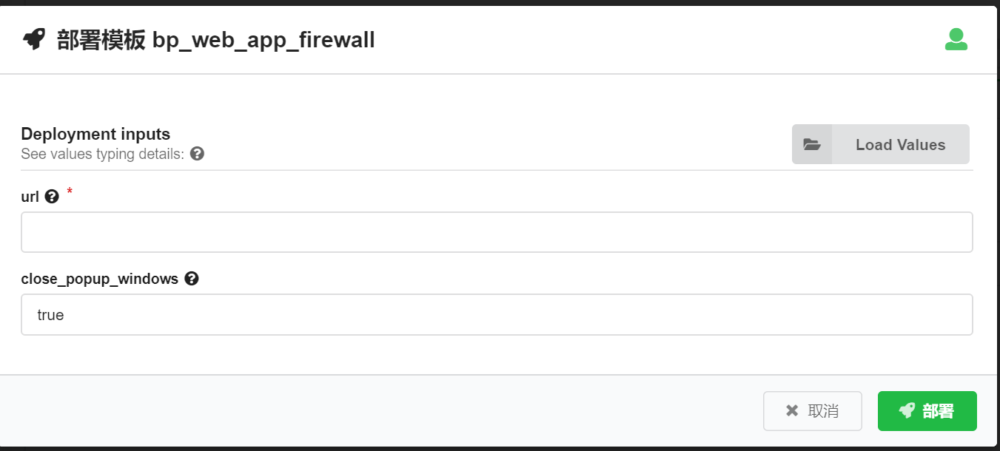

主要展示以下弹窗限制参数：

- **url**
- **关闭弹窗**
- **网关列表**：配置过的网关列表

根据需求需要提供新增、删除、更新按钮，绑定名字为bp_web_app_firewall的蓝图文件：

- **新增**：以waf+url作为部署名称，新建的时候执行创建部署和执行install工作流两步操作，新建输入参数名称如下：

  **url**：对某个网址启用弹窗限制，以url标识

  **关闭弹窗**：输入true（是）或者false（否）分别表示关闭弹窗和不关闭弹窗

- **更新**：只可以修改“关闭弹窗”的配置

- **删除**：执行uninstall工作流并删除部署

widget参数设置：

- **定时刷新**：关闭
- **分页大小**：5
- **排序**：按照序号升序排列

### 5.4用户组

根据需求描述，我们需要提供下面几种上网行为模板：

1、低速类员工用户模板，只能发邮件，打电话；

2、高速类员工用户模板，可以看视频，不能打游戏；

3、boss无限制模板；

4、自定义用户模板，用户可以选择禁止使用的协议，如游戏、视频、电话、邮件等，用户还可以自定义上下行速率。

新建用户组对应到panabit管理配置页面的【用户认证】中【账号管理】的子菜单【地址池】，组中每个用户的上网行为对应的是【应用识别】中的【自定义协议组】，用户组限速对应的是【策略管理】中的【流量控制】，根据需求设计上面四个用户组模板共对应四个蓝图文件，其中boss无限制用户模板，不涉及限速和上网行为，所以仅对应到panabit管理配置页面的【用户认证】中【账号管理】的子菜单【地址池】配置问题。

#### 5.4.1 蓝图

用户组四个模板对应四个蓝图文件：

[**bp_user_group_boss.yaml**](http://192.168.4.221:30000/zhaocuina/panabit_plugin/blob/master/related_blueprints/bp_user_group_boss.yaml)

[**bp_user_group_customize.yaml**](http://192.168.4.221:30000/zhaocuina/panabit_plugin/blob/master/related_blueprints/bp_user_group_customize.yaml)

[**bp_user_group_high_speed.yaml**](http://192.168.4.221:30000/zhaocuina/panabit_plugin/blob/master/related_blueprints/bp_user_group_high_speed.yaml)

[**bp_user_group_low_speed.yaml**](http://192.168.4.221:30000/zhaocuina/panabit_plugin/blob/master/related_blueprints/bp_user_group_low_speed.yaml)

#### 5.4.2 panabit插件

###### 5.4.2.1 无限制用户组

无限制用户组模板不涉及限速和限制用户行为，对应的插件接口为：

    interfaces:
        cloudify.interfaces.lifecycle:
            create:
                implementation: pa.pa_plugin_task.address_pool.create
                inputs: {}
            delete:
                implementation: pa.pa_plugin_task.address_pool.delete
                inputs: {}
1、create方法的具体定义为：

```
@operation
def create(**kwargs):
    L = []
    name = ctx.node.properties['user_group_name']
    polno_int = generate_polno('gateway_user_groups', name, 4096)//动态生成用户组对应的策略编号
    all = get_online_gateway()//获取所有状态为online的在线网关
    if all:
        while True:
            try:
                T = next(all)
                ip_port = T[0]
                login_cookie = T[1]
                gateway_number = T[2]
                address_pool_create(ctx, ip_port, login_cookie)//调用地址池create方法创建新地址池
                L.append(gateway_number)//扩展配置成功的网关列表，用于更新数据库操作
            except StopIteration://循环正常结束，表示在线网关查询完毕
                ctx.logger.info('StopIteration')
                break
            except Exception as e://循环异常结束
                ctx.logger.info(str(e))
gateway_list = ",".join(L)//列表转换为字符串
ctx.logger.info('gateway_list = %s' % (gateway_list))
db_update(ctx, gateway_list, polno_int)//配置成功后更新数据库
```

address_pool_create新建地址池的post URL和data数据格式为：

```
url = 'https://' + login_ip + '/cgi-bin/Pppoe/ippool_add'
post_data = {'name': name, 'start': start, 'end': end,
             'dns': dns, 'ratein': ratein, 'rateout': rateout,
             'maxonlinetime': maxonlinetime, 'clntepa': clntepa,
             'ifname': ifname}

resp = requests.post(
    url, data=post_data, verify=False, cookies=cookie_jar)
```

2、delete方法的具体定义为：

```
@operation
def delete(**kwargs):
    L = []
    name = ctx.node.properties['user_group_name']
    has_user = user_in_group(name)
    if has_user == True:
        ctx.logger.info('This user group has the user existence,prohibit to delete!!')
        return
    all = get_online_gateway()//获取所有状态为online的在线网关
    if all:
        while True:
            try:
                T = all.next()
                ip_port = T[0]
                login_cookie = T[1]
                gateway_number = T[2]
                address_pool_delete(ip_port, login_cookie,name)//调用地址池删除接口删除
                L.append(gateway_number)//扩展删除过的在线网关列表
            except StopIteration:
                ctx.logger.info('StopIteration')
                break
            except Exception as e:
                ctx.logger.info(str(e))
    # ctx.logger.info('L = %s'% L)
    db_delete_and_set_delopy_tbd(name,L)
```

 删除之前需要判断该用户组中是否存在用户，如果存在禁止删除

```
user_in_group
参数：group_name：用户组名字
功能：用来查询该用户组中是否存在用户
返回值：True：存在，False:不存在
```

address_pool_delete删除地址池前要先查询得到待删除用户组对应的pool_id，接口名称为：

```
get_address_pool_id
参数：intype：用户组名字, login_ip, cookie_jar
功能：用来查询名为intype的用户组对应的pool_id
返回值：名为intype的用户组对应的pool_id
```

然后get删除操作对应的URL完成删除操作：

```
del_url = 'https://' + login_ip + '/cgi-bin/Pppoe/ippool_list'
resp = requests.get(
    del_url, verify=False, cookies=cookie_jar, params={'action': 'deletepool', 'id': str(pool_id)})
```

因为之前部署成功过的网关，在配置删除操作时可能并不在线，为了保证所有网关配置的一致性，需要在网关重新上线时将该配置删除，所以在循环删除完成后，需要查询哪些配置过的网关当前不在线，针对不在线网关记录需要删除的配置，即更新设备状态数据库的deploy_tbd字段，待删除用户组在该字段中的格式为：

```
'gateway_user_group:'+id+' '+protocol_group_name+' '+str(polno)
gateway_user_group:用户组名字 自定义协议组名字 策略编号
无限制用户组，自定义协议组名字为unlimited
```

在网关下次重新上线时，用于做一键同步操作。

###### 5.4.2.2 其他用户组

另外三个用户组要实现限速和限制用户行为，比无限制用户模板多了流量控制和自定义协议组的配置过程，对应的插件接口为：

    interfaces:
        cloudify.interfaces.lifecycle:
            create:
                implementation: pa.pa_plugin_task.user_group.create
                inputs: {}
            delete:
                implementation: pa.pa_plugin_task.user_group.delete
                inputs: {}
1、create方法

与无限制用户组相比，多了自定义协议组的新建protocol_group_create流程和流量控制策略的新建flow_control_create。

1）、protocol_group_create

安装pa的配置逻辑，新建自定义协议组首先需要先创建一个新协议组，post URL和data数据格式为：

```
url = 'https://' + login_ip + '/cgi-bin/Protocol/usragp_add'

post_data = {'agpname': agpname, 'agpcname': agpcname}
resp = requests.post(url, data=post_data, verify=False, cookies=cookie_jar)
```

新建之后编辑

```
edit_url = 'https://' + login_ip + '/cgi-bin/Protocol/usragp_edit'

post_data = {'action': 'load', 'agpid': agpname, 'applist': applist_final}
resp = requests.post(edit_url, data=post_data, verify=False, cookies=cookie_jar)
```

2）、flow_control_create

新建流量控制策略之前，首先要查看策略调度是否存在缺省策略组，如果有，则继续，如果没有，则添加一个名为firewall的策略组，并添加至缺省策略组。

```
get_policy_group
参数：login_ip, cookie_jar
功能：查看策略调度是否存在缺省策略组，如果有，则继续，如果没有，则添加一个名为firewall的策略组，并添加至缺省策略组
返回值：策略调度中缺省策略组的策略组编号
```

添加流量控制的post URL和data数据结构，intype为用户组调用get_address_pool_id返回的对应pool_id

```
post_data = {
'polno': polno, 'desc': desc, 'bridge': bridge,'dir': direction,'vlan': vlan,             
'intype':intype_n,'inipnet':inipnet,'iniprng':iniprng,'inport': inport,             'outtype': outtype_n,'outipnet':outipnet,'outiprng':outiprng,'outport': outport,          'proto': proto, 'appid':appid, 'natip':natip, 'hasms':hasms, 'qqcnt':qqcnt,             'action': action, 'iprate':iprate, 'matchact': matchact,'policy':policygrp}

url = 'https://' + login_ip + '/cgi-bin/Setup/policy_addrule'

resp = requests.post(url, verify=False, data=post_data, cookies=cookie_jar )
```

2、delete方法

与无限制用户组相比，多了自定义协议组的删除操作protocol_group_delete和相对应的流量控制策略的删除flow_control_delete。

1）、protocol_group_delete删除的get URL和params参数格式为：

```
list_url = 'https://' + login_ip + '/cgi-bin/Protocol/usragp_list'
resp = requests.get(
list_url, verify=False, cookies=cookie_jar, params={'action' : 'delete', 'agpid' : agpid}
)
```

2）、flow_control_delete删除的get URL和params参数格式为：

```
url = 'https://' + login_ip + '/cgi-bin/Setup/policy_getgrp'
queryparams = {
'action': 'rmvrule', 'policy': int(policygrp), 'ruleid': int(policy_number)}
resp = requests.get(url, verify=False, params=queryparams, cookies=cookie_jar)
```

policy为策略编号ruleid对应的策略组编号，也是缺省策略组的策略组编号。

#### 5.4.3 rest接口

根据需求需要在UCM页面展示网关用户组的一些信息，因此网关用户组的信息需要写进数据库保存，同时UCM stage通过URL访问数据库读取网关用户组信息，显示在页面上。

数据库主要字段说明：

| 字段名称          | 字段说明                     |
| ----------------- | ---------------------------- |
| id                | 用户组名字，唯一标识         |
| max_uplink_rate   | 最大上行速率                 |
| max_downlink_rate | 最大下行速率                 |
| dns_server        | DNS服务器地址                |
| gatewaylist       | 该用户组配置过的网关列表     |
| polno             | 因涉及到流量控制，需要该字段 |
| applist           | 允许或者拒绝的应用           |
| agpname           | 自定义协议组的名字           |

1、数据库增加gateway_user_groups表格。

```
create table gateway_user_groups( 
_storage_id serial primary key,
id text unique not null,
visibility visibility_states default 'global',
gateway_list text,
max_uplink_rate integer,
max_downlink_rate integer,
_tenant_id integer,
_creator_id integer,
dns_server text,
polno integer,
applist text,
agpname text)
```

2、在\manager_rest\storage\resource_models.py中加入对应的gateway_user_groups模型。

```
class GatewayUserGroup(SQLResourceBase):
    __tablename__ = 'gateway_user_groups'

gateway_list = db.Column(db.Text)
max_uplink_rate = db.Column(db.Text)
max_downlink_rate = db.Column(db.Text)
dns_server = db.Column(db.Text)
polno = db.Column(db.Integer)
applist = db.Column(db.Text)
agpname = db.Column(db.Text)
```

3、添加表resource

```
/opt/manager/env/lib/python2.7/site-packages/manager_rest/storage/models.py
from .resource_models import (**********
                              GatewayUserGroup
```

4、在rest里增加gateway_user_groups对应的get方法

```
增加\manager_rest\rest\resources_v3_1\gateway_user_group.py文件，定义get方法。
class GatewayUserGroups(SecuredResource):
    @swagger.operation(responseClass='List[{0}]'.format(models.GatewayUserGroup.__name__))
    @rest_decorators.exceptions_handled
    @rest_decorators.marshal_with(models.GatewayUserGroup)
    @rest_decorators.create_filters(models.GatewayUserGroup)
    @rest_decorators.paginate
    @rest_decorators.sortable(models.GatewayUserGroup)
    @rest_decorators.all_tenants
    @rest_decorators.search('id')
    def get(self, _include=None, filters=None, pagination=None, sort=None,
            all_tenants=None, search=None, **kwargs):
        """
        List All GatewayUserGroups
        """
        return get_storage_manager().list(
            models.GatewayUserGroup,
            include=_include,
            filters=filters,
            substr_filters=search,
            pagination=pagination,
            sort=sort,
            all_tenants=all_tenants,
        )
```

5、导出GatewayUserGroups rest类

```
\manager_rest\rest\resources_v3_1\__init__.py

from .gateway_user_group import GatewayUserGroups
```

6、在endpoint_mapper.py中增加rest mapping

```
 resources_endpoints = {

------

'GatewayUserGroups': 'user_groups',
```

7、增加nginx路由

```
vi /etc/nginx/conf.d/rest-location.cloudify
location ~ ^/api/v(1|2|2\.1|3|3\.1)/(***|user_groups

修改后要重启
systemctl restart nginx.service
```

8、现在stage就可以通过URL的方式来获取网关用户组的信息。

```
fetchParams: (widget, toolbox) =>
        toolbox.getContext().getValue('onlyMyResources') ? {created_by: toolbox.getManager().getCurrentUsername()} : {},

fetchData(widget,toolbox,params) {    
    return toolbox.getManager().doGet('/user_groups',params)
```

当前的stage获取了网关用户组保存在库中的全部信息，如果需要获取指定字段信息，在URL后增加include字段。

```
doGet('/user_groups?_include=id,max_uplink_rate',params)
```

#### 5.4.4 widget

UCM上网关用户组界面如下


展示以下网关用户组参数：

- 用户组名字
- 上行最大速率
- 下行最大速率
- DNS服务器
- 上网行为：如不能游戏、不能看视频等
- 网关列表：配置过的网关列表

根据需求需要四个新建用户组按钮：

- 无限制用户组：该按钮绑定名字为bp_user_group_boss的蓝图文件，接受用户输入用户组名字，上下行不限速，用户行为不限，DNS服务器为114.114.114.114,8.8.8.8
- 高速上网用户组：绑定名字为bp_user_group_high_speed的蓝图文件，接受用户输入用户组名字，上行限速1024 kbps，下行限速1024 kbps，用户行为定义为可以上网，可以看视频，但是不能游戏。
- 低速上网用户组：绑定名字为bp_user_group_low_speed的蓝图文件，接受用户输入用户组名字。上行限速256 kbps，下行限速256 kbps，用户行为定义为可以上网，不能看视频，不能游戏。
- 自定义用户组：绑定名字为bp_user_group_customize的蓝图文件，接受用户输入以下参数：

```
  user_group_name：用户组名字，任意字符。

  max_downlink_rate：下行最大速率，单位为kbps。

  max_uplink_rate：上行最大速率，单位为kbps。

  not_allowed_app：不允许的应用，目前支持的是game，video，mobile，webmail四种情况的排列组合
```

用户可以查看用户组名字，配置的上下行最大速率，DNS服务器，以及已经完成当前用户组配置的网关编号列表。点击各个按钮可以新增用户组。

widget参数设置：

- 定时刷新：关闭
- 分页大小：5
- 排序：按照用户组名字升序排序

1、增加无限制用户组

上下行无限制，协议组无限制，dns服务器设置为114.114.114.114,8.8.8.8。

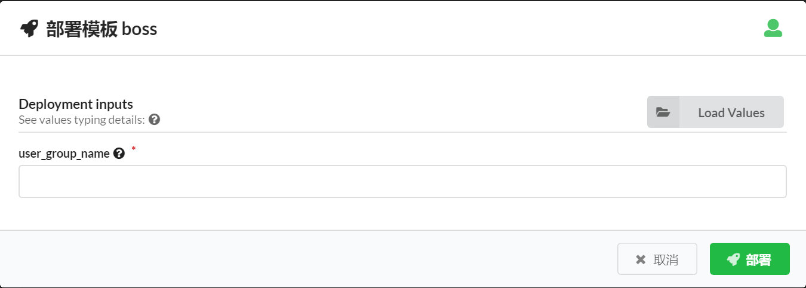

2、高速上网用户组

上行限速1024 kbps，下行限速1024 kbps，协议组设置为不能游戏。

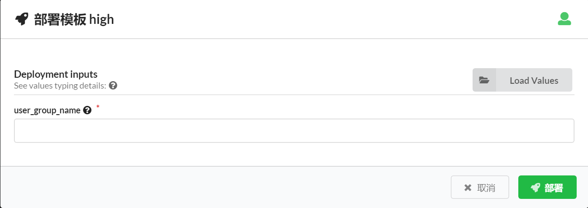

3、低速上网用户组

上行限速256 kbps，下行限速256 kbps，协议组设置为不能看视频，不能打游戏。

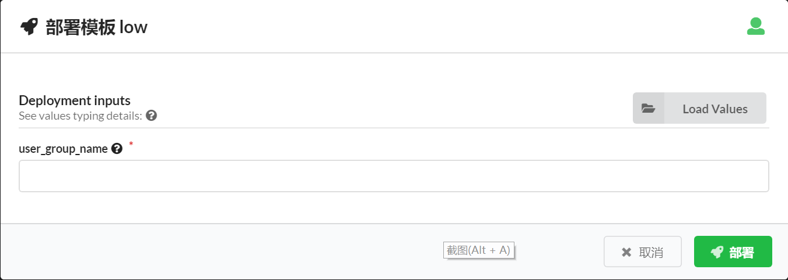

4、自定义用户组

自定义用户组接受用户自定义上行速率，下行速率，以及不允许使用的应用，目前仅支持设置不能游戏，不能看视频，不能发邮件，不能打电话这四种情况各种排列组合。

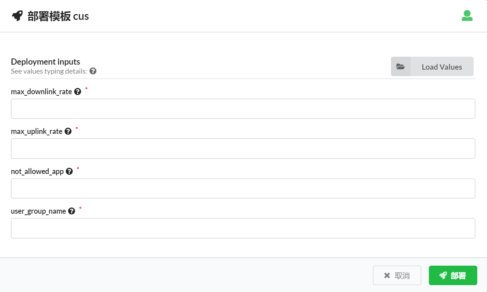

所有新建用户组均可以接受用户自定义用户组名字，但是用户组名字不能重复，不然配置不生效。

### 5.5 QOS

QOS规则对应的需求是双向限速和session数目限制功能，对应到panabit管理配置页面的【策略管理】中的【流量控制】和【连接控制】

#### 5.5.1 蓝图

[**bp_qos.yaml**](http://192.168.4.221:30000/zhaocuina/panabit_plugin/blob/master/related_blueprints/bp_qos.yaml)

#### 5.5.2 panabit插件

qos对应的插件接口函数为

```
    interfaces:
        cloudify.interfaces.lifecycle:
            create:
                implementation: pa.pa_plugin_task.qos.create
                inputs: {}
            delete:
                implementation: pa.pa_plugin_task.qos.delete
                inputs: {}
```

1、create接口函数

```
flow_control_create
同网关用户组
```

connection_control_create首先查看连接控制的策略调度是否存在缺省策略组，如果存在，则返回缺省策略组的策略组编号，如果不存在，新建一个名为qos的策略组，并添加至缺省策略组。

```
get_policy_group
参数：login_ip, cookie_jar
功能：查看连接控制的策略调度是否存在缺省策略组，如果存在，则返回缺省策略组的策略组编号，如果不存在，新建一个名为qos的策略组，并添加至缺省策略组。
返回值：缺省策略组的策略组编号
```

连接控制post URL和data的数据格式为：

```
post_data = {'polno': polno, 'bridge': '0','intype':'any','inipnet':'','iniprng':'',                  'inport': '0','outtype': 'any','outipnet':'','outiprng':'','outport': '0',                'appid':'any', 'maxtflow':maxtflow, 'maxuflow':maxuflow,'maxflow':maxflow,                'policy':policygrp}
url = 'https://' + login_ip + '/cgi-bin/Setup/conlimit_addrule'
resp = requests.post(url, verify=False, data=post_data, cookies=cookie_jar )
```

2、delete接口函数

connection_control_delete删除的getURL和params格式：

```
url = 'https://' + login_ip +'/cgi-bin/Setup/conlimit_getgrp'

params_data = {'action': 'rmvrule', 'group':int(policygrp), 'ruleid': policy_num}
resp = requests.get(url, verify=False, cookies=cookie_jar, params= params_data)
```

因为之前部署成功过的网关，在配置删除操作时可能并不在线，为了保证所有网关配置的一致性，需要在网关重新上线时将该配置删除，所以在循环删除完成后，需要查询哪些配置过的网关当前不在线，针对不在线网关记录需要删除的配置，即更新设备状态数据库的deploy_tbd字段，待删除用户组在该字段中的格式为：

```
qos:policy_num
qos:策略编号
```

#### 5.5.3 Rest

数据库主要字段说明：

| 字段名称          | 字段说明                                       |
| ----------------- | ---------------------------------------------- |
| id                | qos规则名字                                    |
| wan_line          | 要进行qos限制的wan连接名字                     |
| direction         | 要进行qos限制的wan连接方向，如上行、下行、双向 |
| ip_rate           | 数据流限速值                                   |
| max_tcp_session   | 最大TCP Session数限制                          |
| max_udp_session   | 最大UDP Session数限制                          |
| max_total_session | 上网用户Session总数限制                        |
| gatewaylist       | 该QoS规则配置过的网关编号列表                  |
| polno             | 因涉及到流量控制，需要该字段                   |

注：qos规则polno从2048开始递增。

1、数据库增加qos表格。

```
create table qos( 
_storage_id serial primary key,
id text ,
visibility visibility_states default 'global',
wan_line  text,
direction text,
ip_rate integer, 
max_tcp_session integer, 
max_udp_session integer, 
max_total_session integer, 
polno integer ,
gatewaylist text);
```

2、在\manager_rest\storage\resource_models.py中加入对应的qos模型。

```
class QoS(SQLResourceBase):    
    __tablename__ = 'qos'    

wan_line = db.Column(db.Text)    
direction = db.Column(db.Text)    
ip_rate = db.Column(db.Integer)    
max_tcp_session = db.Column(db.Integer)    
max_udp_session = db.Column(db.Integer)    
max_total_session = db.Column(db.Integer)    
gateway_list = db.Column(db.Text)    
polno = db.Column(db.Integer)
```

3、在rest里增加qos对应的get方法

增加\manager_rest\rest\resources_v3_1\qos.py文件，定义get方法。

```
class QoS(SecuredResource):    @swagger.operation(responseClass='List[{0}]'.format(models.QoS.__name__))    @rest_decorators.exceptions_handled    
@rest_decorators.marshal_with(models.QoS)    
@rest_decorators.create_filters(models.QoS)    
@rest_decorators.paginate    
@rest_decorators.sortable(models.QoS)    
@rest_decorators.all_tenants    
@rest_decorators.search('id')    
def get(self, _include=None, filters=None, pagination=None, sort=None,            all_tenants=None, search=None, **kwargs):        
"""        List All QosRuleTable        """        
return get_storage_manager().list(            
models.QoS,            
include=_include,            
filters=filters,            
substr_filters=search,            
pagination=pagination,            
sort=sort,            
all_tenants=all_tenants,)
```

#### 5.5.4 widget

UCM上QoS规则界面如下：


主要展示以下qos规则参数：

- qos规则名字
- wan线路：wan线路名字
- 方向：上行，下行，双向
- 内网限速：限速值
- TCP连接数：最大TCP连接数
- UDP连接数：最大UDP连接数
- 总连接数：总连接数
- 网关列表：配置过的网关列表
- 提供一个新建QoS规则按钮：

​        新建QoS规则：绑定名字为bp_qos的蓝图文件，接受用户输入以下参数：

```
   qos_rule_name：qos规则名字，任意字符。

   wan_line：qos规则作用的wan线路名字。

   direction：qos规则作用的wan线路方向，in（下行）、out（上行）、both（双向）。

   ip_rate：内网限速，单位kbps。

   max_tcp_session：最大TCP连接数

   max_udp_session：最大UDP连接数

   max_total_session：最大总连接数
```

widget参数设置：

- 定时刷新：关闭
- 分页大小：5
- 排序：按照QoS规则名字升序排序

点击新建可以创建新的QoS规则


### 5.6账号管理

​       根据需求先在网关上查询用户组信息，有用户组存在，则在认证服务器（radius）上创建账号。并添加相应账号的限制策略。

​      先通过PA的插件在云平台上查询全部网关用户组，再通过radius插件在radius-service上新建用户，通过
Max-All-Session，Login-Time，Max-Monthly-Session，Max-Monthly-Traffic，4个radius的属性值分别限制用户的最大总时长，允许登录时间段，最大每月时长，和最大每月流量。通过Cleartext-Password属性控制用户登录密码。通过用户组的Framed-Pool属性向PA网关回复用户组信息，来限制基于用户组的流量策略。
​	对应已经存在的用户，重新执行部署时，将在radius上对用户的限制属性进行更新操作。

#### 5.6.1蓝图

​	[dd_user_with_att.yaml](http://192.168.4.221:30000/woody/radius_plugin/blob/master/blueprint/add_user_with_att.yaml)

#### 5.6.2数据表

radius的数据库的radgroupreply保存用户组信息

|  id  | groupname |  attribute  |  op  | value  |
| :--: | :-------: | :---------: | :--: | :----: |
|  x   |  用户名   | Framed-Pool |  :=  | 用户名 |


radusergroup表保存用户和用户组关联关系

| username | groupname | priority |
| :------: | :-------: | :------: |
|  用户名  |   组名    |    0     |


radcheck表保存用户检查属性（同时保存了用户密码和用户的限制属性）

| id   | username | attribute           | op   | value                               |
| ---- | -------- | ------------------- | ---- | ----------------------------------- |
| X    | 用户名   | Max-Daily-Session   | :=   | 60                                  |
| X    |          | Login-Time          | :=   | Wk0855-2225,Sa0000-1621,Su0005-2355 |
| X    |          | Cleartext-Password  | :=   | 123456                              |
| X    |          | Max-Monthly-Session | :=   | 2900                                |
| X    |          | Max-All-Session     | :=   | 60                                  |


userinfo 保存用户个人信息 部分字段为

| username | email | mobilephone |    creationdate     | creationby |
| :------: | :---: | :---------: | :-----------------: | :--------: |
|  用户名  |   0   |      0      | 2019-09-03 14:15:18 | UCM_admin  |

#### 5.6.3radius插件接口

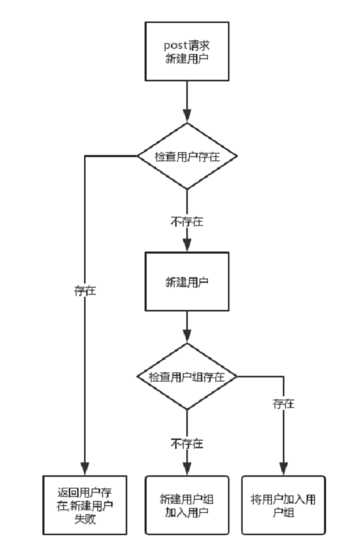


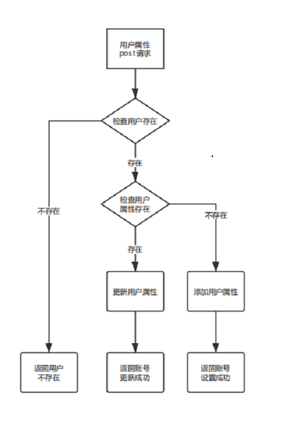

	新增用户：
		通过post向ip/daloradius/library/add_user.php
		发送{
		    "username":"",
		    "attribute":"Cleartext-Password",
		    "op":":=",
		    "value":"",
		    "groupname":"",
		    "group_att_reply":"Framed-Pool"
		}
		在radius中查询是否存在该用户，若存在则返回 ：{status : 0, msg : "用户存在,新建用户失败"}
		不存在则新建用户 ，同时查询用户组存在，若用户组不存在则新建用户组，加入用户，用户组存在则加入用户到用户	组最终返回：{status : 1, msg : "新建用户成功"}
		
		用户限制：
		通过post向ip/daloradius/library/add_user_att.php
		发送{
			    "username":"",
			    "attribute":"",
			    "op":":=",
			    "value":"",
			}
		在radius中查询是否存在该用户，若不存在则返回 ：{status : 0, msg : "用户不存在"}
		存在用户，则检查该用户是否已经有该属性，没有该属性，则设置并返回：{status : 1, msg : "账号设置成功"}，有该属性，则修改设置并返回：{status : 2 ,msg : "账号更新成功"}
#### 5.6.4widget


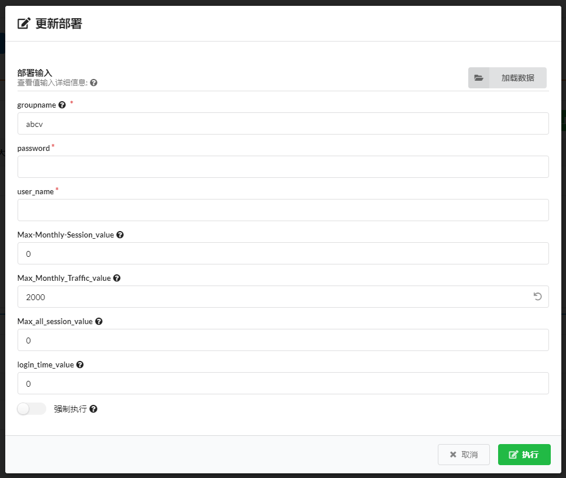


### 5.7密码重置

根据需求在radius-service上查询用户信息，重置用户的登录密码。即通过radius插件查询用户的信息，并在插件中指定默认的密码为88888888，重置用户的登录密码。

#### 5.7.1蓝图

 [Account_reset.yaml](http://192.168.4.221:30000/woody/radius_plugin/blob/master/blueprint/Account_reset.yaml)

#### 5.7.2数据表

radius的数据表数据操作

将radcheck表保存用户属性内容为Cleartext-Password的value值改为默认值


|  id  | username |     attribute      |  op  |  value   |
| :--: | :------: | :----------------: | :--: | :------: |
|  X   |  用户名  | Cleartext-Password |  :=  | 88888888 |

#### 5.7.3radius插件接口

radius-rest

```
密码重置：
	通过post向ip/daloradius/library/user_reset.php
	发送{
		    "username":"",
		    "password":"88888888"
		}
	在radius中查询是否存在该用户，若不存在则返回 ：{status : 0, msg : "用户不存在"}
	存在则重置密码，并返回：{status : 0, msg : "用户不存在"}
```

#### 5.7.4widget

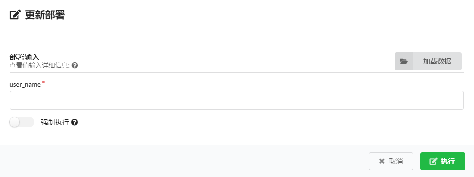

#### 5.8用户流量查询

根据需求，要在radius-service上查询用户流量信息，并写入ucm的数据库并在UCM界面显示。具体为通过radius的插件查询用户流量，写入ucm数据库，通过ucm的stage的进行分类排序，按用户id指定查询信息。新建的用户在未使用流量时，radius无法查询到信息，通过在ucm新建用户时，写入新用户初始化信息。并在stage页面上绑定事件，通过按钮来更新数据库中的流量信息。

#### 5.8.1蓝图

 	 [Traffic_query.yaml](http://192.168.4.221:30000/woody/radius_plugin/blob/master/blueprint/Traffic_query.yaml)

#### 5.8.2数据表

radius的数据表数据操作

聚合查询radacct表中的部分字段，通过接口传递到ucm数据库

| UserName | FramedIPAddress | AcctStartTime | AcctStopTime | AcctSessionTime | AcctInputOctets | AcctOutputOctets | NASIPAddress |
| -------- | --------------- | ------------- | ------------ | --------------- | --------------- | ---------------- | ------------ |
| 用户名   | 用户ip          | 上线时间      | 下线时间     | 在线总时间      | 流入流量        | 流出流量         | 网关ip       |


ucm的数据表 usageamou t部分字段

| id   | login_ip | hours_of_use | upload_traffic | download_traffic | all_traffic | nas_ip | update_time | user_group | create_time |
| ---- | -------- | ------------ | -------------- | ---------------- | ----------- | ------ | ----------- | ---------- | ----------- |
|      | 用户ip   | 使用总时间   | 上线流量       | 下行流量         | 总流量      | 网关ip | 更新时间    | 用户组     | 创建时间    |

radius-rest

#### 5.8.3radius插件接口

radius-rest

```
流量查询：
	通过post向ip/library/mysql_query.php
	发送{
		    "username":"",
		    "month_num":""
		}
	当month_num为从当前月开始向前查询的月数，username为空，或者为all时，则查询全部用户信息，并返回查询结果，当用户不存在时，则返回为空。
	
```


#### 5.8.4widget

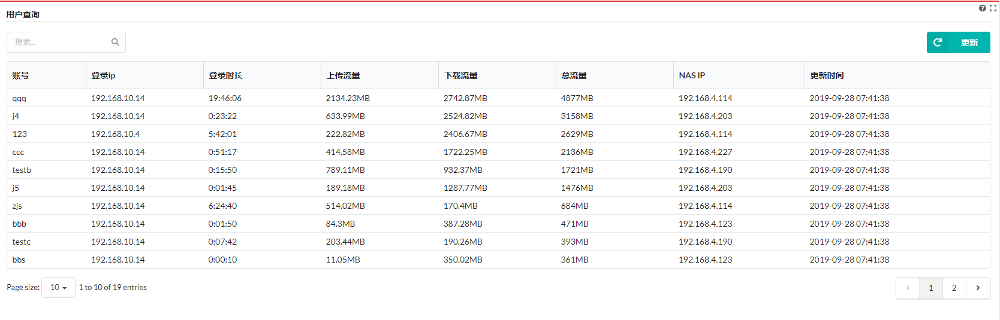

#### 5.9网关链路查询

根据需求要在云平台上读取网关（panabit）登录信息，在进入每一个网关分别查询到每个网关的每条链路情况。即通过pa插件在获取每个网关的临时进入端口，在逐个进入每个网关获取网络接口，将页面中的链路信息筛选提取，并写入ucm数据库，通过stage页面显示。

#### 5.9.1蓝图

[bp_line_query.yaml](http://192.168.4.221:30000/zhaocuina/panabit_plugin/blob/master/pa_plugin/pa_plugin_task/line_query.py)

#### 5.9.2数据表

ucm的数据表 usageamou t部分字段

| id   | name     | inpps          | inbps    | outpps         | state | outbps   | update_time | gateway  | sys_name |
| ---- | -------- | -------------- | -------- | -------------- | ----- | -------- | ----------- | -------- | -------- |
|      | 链路名称 | 每秒流入数据包 | 流入速率 | 每秒流出数据包 | 状态  | 流出速率 | 更新时间    | 网关名称 | 编号     |

#### 5.9.3panabit插件接口

```
链路查询：
	通过cloud查询网关访问端口，再通过get访问ip:port/cgi-bin/Monitor/if_stat获取数据
	再通过post访问ip:port/cgi-bin/Monitor/ajax_if_stat获取数据，将两次获取的数据清洗筛选
```

#### 5.9.4widget

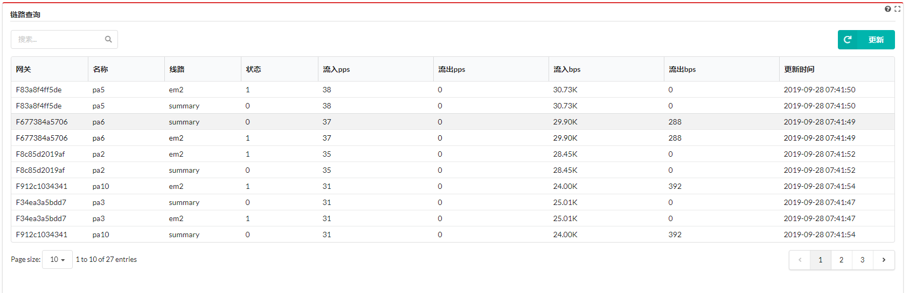

### 5.10设备状态

#### 5.10.1蓝图

http://192.168.4.221:30000/zhaocuina/panabit_plugin/blob/master/related_blueprints/chris-equipment-statu.yaml

#### 5.10.2数据表

数据库表equipment_status主要字段说明：

| 字段名称   | 字段说明  |
| ---------- | --------- |
| license_id | 网关ID    |
| sys_name   | 名称      |
| state      | 状态      |
| valid_time | 有效期    |
| bps        | 上行/下行 |
| version    | 当前版本  |
| time_str   | 最后在线  |
| users      | 用户      |
| temp_cpu   | 温度/cpu  |

### 5.10.3panabit插件接口
#pa_get_equipment_statu.py

全局变量：

```
	data  = {
		"type" : "cloud_devlist" ,
		"grpid" : "0" ,
		"sch" : "" ,
		"sort" : "license_id12" ,
		"g_ascdesc" : "asc" ,
		"page" : "1" ,
		"limit" : "20" ,
		"expire" : "0"}	//要post的data
	data2 =	{'user':'admin','pass':'panabit'}
```

局部变量：

```
	cookies =requests.post('https://%s/Maintain/cloud_login.php'%ip,data=data2,
		verify=False, timeout=15）.cookies	//获取云平台登录的cookie	
```

主要方法：

```

	requests.post('https://%s/Maintain/system_handle.php' % ip,data=data, 
 				cookies=cookies,verify=False, timeout=5)	//获取网关所有信息	
    
    psycopg2.connect(database='cloudify_db', user='cloudify', password='cloudify', 
 				host='127.0.0.1', port='5432')	//连接数据库进行增加更新操作
```

主要接口函数：

```
	get_gateway_info()	//获取网关信息	
	
 				
	get_equipment_status(ip, cookies,license_id,conn,cur)	//处理在线网关，更新状态
	参数：
		ip，云平台ip
		cookie，云平台登录的cookie
		license_id,网关编号，网关的唯一编号
		coon，数据库对象
		cur，游标对象
	作用：获取pa在线网关并根据和数据库里的数据做对比，更新数据库或插入操作
	
	setStateOff()	//处理离线网关,并及时更新状态
	参数：无
	作用：及时将pa已离线的网关状态记录并更新数据库的状态
```


### 5.10.4REST
REST增加表equipment_status的模型和对应的REST接口

1）文件（modles.py 及resource_models.py）

```
class Equipment_status(SQLResourceBase):
    __tablename__ = 'equipment_status'
    license_id = db.Column(db.Text)
    sys_name = db.Column(db.Text)
    state = db.Column(db.Text)
    time_str = db.Column(db.Text)
    valid_time = db.Column(db.Text)
    users = db.Column(db.Text)
    flowcont = db.Column(db.Text)
    bps = db.Column(db.Text)
    sys_run = db.Column(db.Text)
    temp_cpu = db.Column(db.Text)
    version = db.Column(db.Text)
```

2）增加equipment_status表的get方法

```
def get(self, _include=None,filters=None, pagination=None,
            sort=None, all_tenants=None, search=None, **kwargs):
     return get_storage_manager().list(
         models.Equipment_status,
         include=_include,
         filters=filters,
         pagination=pagination,
         sort=sort,
         all_tenants=all_tenants,
         substr_filters=search,)
参数：
	pagination,分页
	filter，过滤
	sort，排序
	_include，包含字段
	all_tenants,所有租户，
	search，查询
```

### 5.10.4widget

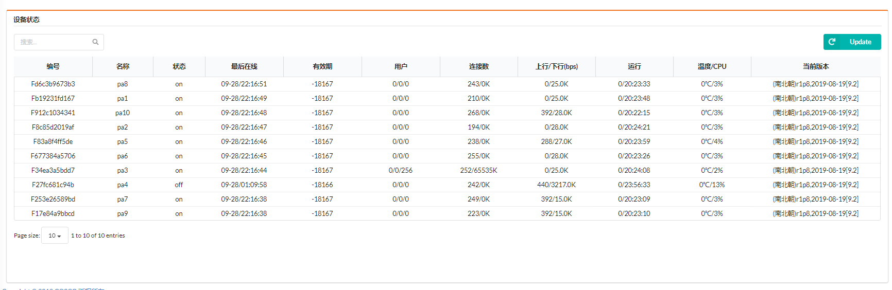

主要展示以下设备状态参数：

- **序号**
- **编号**：网关的ID
- **名称**
- **状态**：分为“offline","adopting","online"三种
- **最后在线**
- **有效期**
- **用户**
- **连接数**
- **上行/下行(bps)**
- **运行**
- **温度/CPU**
- **当前版本**

新建更新按钮：

- **更新**：该按钮绑定名称为equipmentstatu的部署，以及“install”工作流

#### widget参数设置：

- **定时刷新**：关闭

- **分页大小**：10

- **排序**：所有字段均有升序降序排列

  


### 5.11接口查询

#### 5.11.1蓝图

http://192.168.4.221:30000/zhaocuina/panabit_plugin/blob/master/related_blueprints/chris-interface-search.yaml

#### 5.11.2数据表

数据库主要字段说明：

| 字段名称       | 字段说明                      |
| -------------- | ----------------------------- |
| interface_name | 接口名称                      |
| network_card   | 要进行qos限制的wan连接名字    |
| state          | 状态                          |
| ip             | ip                            |
| mtu            | mtu                           |
| vlan           | vlan                          |
| inflow_rate    | 流入速率                      |
| outflow_rate   | 该QoS规则配置过的网关编号列表 |
| licence_id     | 网关ID                        |

此表显示接口的详细信息，分为LAN口和WAN口，带过滤功能，可以以网关ID作为唯一过滤条件进行过滤，以10条数据为一 页进行分页，刷新功能可以重新执行部署工作流，对数据进行更新或者插入操作

#### 5.11.3panabit插件接口

#standard_pa_get_interface_search.py

主要方法：

```
  requests.get('https://%s/cgi-bin/Route/ajax_proxy_list?action=loadlan'%ip_port, 
 				cookies=cookies,verify=False, timeout=5)				//获取lan口信息
 				
 requests.get('https://%s/cgi-bin/Route/iflan_list'%ip_port, 
 				cookies=cookies,verify=False, timeout=5)				//获取lan掩码信息
 				
 requests.post('https://%s/cgi-bin/Route/ajax_proxy_list?action=loadwan&keyword=&group='
            % ip_port, cookies=cookies, verify=False, timeout=5)	 //获取wan口信息
 
 requests.post('https://%s/cgi-bin/Route/ajax_proxy_remark' % ip_port, cookies=cookies,
                         verify=False, timeout=5)						//获取wan备注信息
                         
 psycopg2.connect(database='cloudify_db', user='cloudify', password='cloudify', 
 				host='127.0.0.1', port='5432')					//连接数据库进行增加，更新操作
 
```

主要接口函数:

```
 get_gateway_info()	//获取网关信息
 
 setStateOff()		//将设备状态的状态重置为off
 
 lan_interface(ip_port,cookies,license_id)	//lan接口,更新数据库接口
 
 wan_interface(ip_port,cookies,license_id)	//wan接口，更新数据库接口
```

#### 5.11.4REST

REST增加表lan_interface,wan_interface的模型和对应的REST接口

1）文件（modles.py 及resource_models.py）

```
#lan
class Standard_interface_search_lan(SQLResourceBase):
    __tablename__ = 'standard_lan_interface'
    id_ = db.Column(db.Text)
    name_ = db.Column(db.Text)
    if_ = db.Column(db.Text)
    state = db.Column(db.Text)
    ip = db.Column(db.Text)
    netmask = db.Column(db.Text)
    mtu = db.Column(db.Text)
    vlan = db.Column(db.Text)
    inbps = db.Column(db.Text)
    outbps = db.Column(db.Text)
    license_id_ = db.Column(db.Text)

#wan
class Standard_interface_search(SQLResourceBase):
    __tablename__ = 'standard_wan_interface'
    id_ = db.Column(db.Text)
    name_ = db.Column(db.Text)
    if_ = db.Column(db.Text)
    state = db.Column(db.Text)
    ip = db.Column(db.Text)
    gw = db.Column(db.Text)
    mtu = db.Column(db.Text)
    vlan = db.Column(db.Text)
    dnsfail_disable = db.Column(db.Text)
    inbps = db.Column(db.Text)
    outbps = db.Column(db.Text)
    flowcnt = db.Column(db.Text)
    group_ = db.Column(db.Text)
    license_id_ = db.Column(db.Text)
    remark = db.Column(db.Text)
```

2）增加lan_interface，wan_interface表的get方法

```
#lan
class StandardInterfaceSearchLan(SecuredResource):
    @swagger.operation(responseClass='List[{0}]'.format(
    models.Standard_interface_search_lan.__name__))
    @rest_decorators.exceptions_handled
    @rest_decorators.marshal_with(models.Standard_interface_search_lan)
    @rest_decorators.paginate
    @rest_decorators.sortable(models.Standard_interface_search_lan)
    @rest_decorators.all_tenants
    @rest_decorators.search('id')
    def get(self,  _include=None, filters=None, pagination=None,
            sort=None, all_tenants=None, search=None,  **kwargs):
        return get_storage_manager().list(
            models.Standard_interface_search_lan,
            include=_include,
            filters=filters,
            pagination=pagination,
            sort=sort,
            all_tenants=all_tenants,
            substr_filters=search,)
 
#wan 
class StandardInterfaceSearch(SecuredResource):
 	@swagger.operation(responseClass='List[{0}]'.format(
 	models.Standard_interface_search.__name__))
    @rest_decorators.exceptions_handled
    @rest_decorators.marshal_with(models.Standard_interface_search)
    @rest_decorators.all_tenants
    @rest_decorators.search('package_name')
    def get(self, _include=None, all_tenants=None, **kwargs):
        return get_storage_manager().list(
            models.Standard_interface_search,
            include=_include,
            all_tenants=all_tenants).items
```


### 5.11.5widget

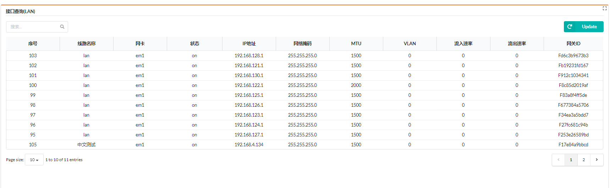


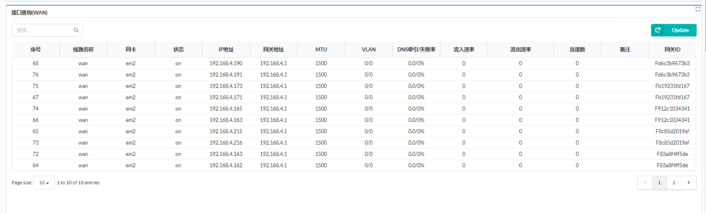

主要展示以下接口查询(WAN)参数：

- **序号**
- **线路名称**:区分lan口和wan口
- **网卡**
- **状态**：分为“on","off"两种
- **IP地址**
- **网关地址**
- **MTU**：mtu值，最大传输单元
- **VLAN**
- **DNS牵引/失败率**
- **流入速率**
- **流出速率**
- **连接数**
- **网关ID**

接口查询(LAN)不同参数：

- **网络掩码**

新建更新按钮：

- **更新**：该按钮绑定名字为standardinterfacesearch的部署，以及“install”工作流

#### widget参数设置：

- **定时刷新**：关闭
- **分页大小**：10
- **排序**：可根据网关ID字段升序降序排列


### 5.12链路策略

#### 5.12.1蓝图

http://192.168.4.221:30000/zhaocuina/panabit_plugin/blob/master/related_blueprints/chris-policy-route.yaml

#### 5.12.2数据表

数据库主要字段说明：

| 字段名称         | 字段说明      |
| ---------------- | ------------- |
| number           | 序号          |
| source_interface | 源接口        |
| vlan             | vlan          |
| ttl              | ttl           |
| source_addr_port | 源地址/端口   |
| to_addr_port     | 目标地址/端口 |
| protocol         | 协议          |
| application      | 应用          |
| state            | 状态          |

#### 5.12.3panabit插件接口

#standard_pa_get_policy_route.py

主要接口函数：

```
	policy_route_search()	//获取pa策略路由数据的处理函数 
		入参：ip_port,license_id,cookies
		返回值：策略路由编号
	data_filter(html)	//正则处理函数
		入参：html:字符串
		返回值：处理过的字符串
	deleteOff(num_L)	//更新数据库函数
		入参：num_L:策略路由编号的列表
	main：主函数，逻辑控制
		入参：无
```


#### **5.12.4REST**

REST增加表Policyroute的模型和对应的REST接口

1）文件（modles.py 及resource_models.py）

```
class Policyroute(SQLResourceBase):
    __tablename__ = 'policyroutes'
    number = db.Column(db.Text)
    current = db.Column(db.Text)
    user_group = db.Column(db.Text)
    source_interface = db.Column(db.Text)
    vlan = db.Column(db.Text)
    ttl = db.Column(db.Text)
    source_addr_port = db.Column(db.Text)
    to_addr_port = db.Column(db.Text)
    protocol = db.Column(db.Text)
    application = db.Column(db.Text)
    dscp = db.Column(db.Text)
    user_type = db.Column(db.Text)
    action = db.Column(db.Text)
    to_route = db.Column(db.Text)
    next_jump = db.Column(db.Text)
    match_times = db.Column(db.Text)
    remark = db.Column(db.Text)
    state = db.Column(db.Text)
```

2）增加表Policyroute的get方法

```
class Policyroutes(SecuredResource):
    @swagger.operation(responseClass='List[{0}]'.format(models.Policyroute.__name__))
    @rest_decorators.exceptions_handled
    @rest_decorators.marshal_with(models.Policyroute)
    @rest_decorators.paginate
    @rest_decorators.sortable(models.Policyroute)
    @rest_decorators.all_tenants
    @rest_decorators.search('number')
    def get(self,  _include=None, filters=None, pagination=None,
            sort=None, all_tenants=None, search=None,  **kwargs):
        return get_storage_manager().list(
            models.Policyroute,
            include=_include,
            filters=filters,
            pagination=pagination,
            sort=sort,
            all_tenants=all_tenants,
            substr_filters=search,)
```

### 5.12.5widget

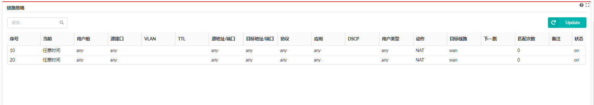

主要展示以下链路策略参数：

- **序号**：链路策略的唯一标识
- **当前**
- **用户组**
- **源接口**
- **VLAN**
- **TTL**：time to live，生存时间
- **源地址/端口**
- **目标地址/端口**
- **协议**
- **应用**
- **DSCP**：Differentiated Services CodePoint	差分服务编码点
- **用户类型**
- **动作**
- **目标线路**
- **下一跳**
- **状态**：分为“on","off"两种

新建更新按钮：

- **更新**：该按钮绑定名字为standardpolicyroute的部署，以及“install”工作流

#### widget参数设置：

- **定时刷新**：关闭

- **分页大小**：10

- **排序**：可以根据序号字段升序降序排列

  

### 5.13 一键同步

​    网关的状态共有三种：离线、上线中、在线，一键同步功能针对的是上线中网关，经过一键同步之后的网关状态置为online。

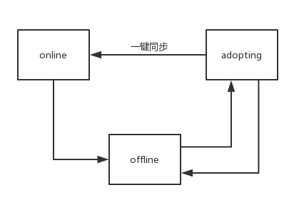

#### 5.13.1 蓝图

  [**bp_one_click_deployment.yaml**](http://192.168.4.221:30000/zhaocuina/panabit_plugin/blob/standard/related_blueprints/bp_one_click_deployment.yaml)

#### 5.13.2 插件

```
cloudify.pa.one_click_deployment:
    derived_from: cloudify.nodes.Root
    interfaces:
      cloudify.interfaces.lifecycle:
        create:
          implementation: pa.pa_plugin_task.one_click_deployment.create
```

 1、create接口函数

​        首先是调用公共接口get_adopting_gateway查询上线中的网关，如果存在上线中网关，下一步就调用接口get_db_record读取数据库里已经存在的网关用户组、qos、防火墙、MTU配置规则，分别保存在全局变量gateway_user_groups_db_record 、qos_db_record 、firewall_db_record 、lan_interface_db_record 、wan_interface_db_record 、mtu_conf_db_record 里，因为网关有可能不是第一次上线，为了保证网关配置的一致性，在新增配置之前，先检查网关设备里有没有需要删除的配置，每个设备状态里都有一个名为deploy_tbd的字段用于标记是否有需要删除的配置，例如：qos: policy_num(策略编号),gateway_user_groups:name apgname policy_num(用户组名字 自定义协议组名字 策略编号)，针对一个网关循环处理需要删除的东西，然后再按照已经保存在全局变量里的配置，循环增加需要同步的配置。

需要定义以下全局变量：

```
one_click_deployment_dict = {
'gateway_user_groups':{'gateway_list_index':3,'db_key_name':'id','db_key_value_index':1},
'qos':{'gateway_list_index':9,'db_key_name':'id','db_key_value_index':1},
'firewall':{'gateway_list_index':3,'db_key_name':'policy_number','db_key_value_index':4},
'lan_interface':{},
'wan_interface':{},
'mtu_conf':{}}
db_update_gateway_list_skip = ['lan_interface','wan_interface','mtu_conf']
gateway_user_groups_db_record = []
qos_db_record = []
firewall_db_record = []
lan_interface_db_record = []
wan_interface_db_record = []
mtu_conf_db_record = []
```

调用的主要接口函数：

```
get_adopting_gateway()
参数：无；
作用：用来获取所有状态为上线中的网关Id；
	获取上线中网关的详细信息；
返回值：一个上线中的网关的网关Id，ip:端口号，cookies,待删除配置deploy_tbd组成的生成器，        
	如果获取cookies失败则更新该上线中的网关为离线；

get_db_record
参数：无
功能：循环读取数据库表名称为one_click_deployment_dict.key的所有记录，并保存在相应的全局变量里
    for key in one_click_deployment_dict:
        db_record_name = key +'_db_record'
        cur.execute("select * from %s" % (key))
        globals()[db_record_name]=cur.fetchall()
返回值：无

one_click_deployment_delete
参数：deploy_tbd,ip_port,login_cookie
功能：删除待删除配置，待删除配置deploy_tbd的格式为：
gateway_user_groups:apple high_speed_user 4098,qos:2050,firewall:234
    tbd_list = deploy_tbd.split(',')//逗号分隔成一个列表
    for x in tbd_list:
        dep_list = x.split(':')//冒号分隔
        if dep_list[0] == 'qos'://取分隔后的第一个字段，判断属于哪个配置，然后调用相应的接口删除
            ctx.logger.info(dep_list[1])
            one_click_deployment_qos_delete(ip_port, login_cookie, dep_list[1])
返回值：无

one_click_deployment_user_groups
参数：db_result,ip_port,login_cookie
功能：针对一个上线中网关，根据数据库中gateway_user_groups的记录，循环增加用户组配置
返回值:无

one_click_deployment_qos
参数：db_result,ip_port,login_cookie
功能：针对一个上线中网关，根据数据库中qos的记录，循环增加qos配置
返回值:无

one_click_deployment_firewall
参数：db_result,ip_port,login_cookie
功能：针对一个上线中网关，根据数据库中firewall的记录，循环增加firewall配置
返回值:无

one_click_deployment_interface
参数：ip_port,login_cookie
功能：针对一个上线中网关，根据数据库中MTU配置，更改网关lan侧和wan侧MTU
返回值:无

one_click_deployment_db_update
参数：adopting_gateway_list
功能：一键同步完成后，按照adopting_gateway_list列表更新网关adopting状态为online，清除deploy_tbd字段，更新同步成功后的网关列表，更新wan/lan MTU参数
返回值：无
```

#### 5.13.3 widget

一键同步页面如下：


一键同步按钮：

该按钮绑定名称为one_click_deployment的部署，以及“install”工作流，点击同步按钮将会针对新上线网关和再次上线网关一键同步。

widget参数设置：

- 定时刷新：关闭