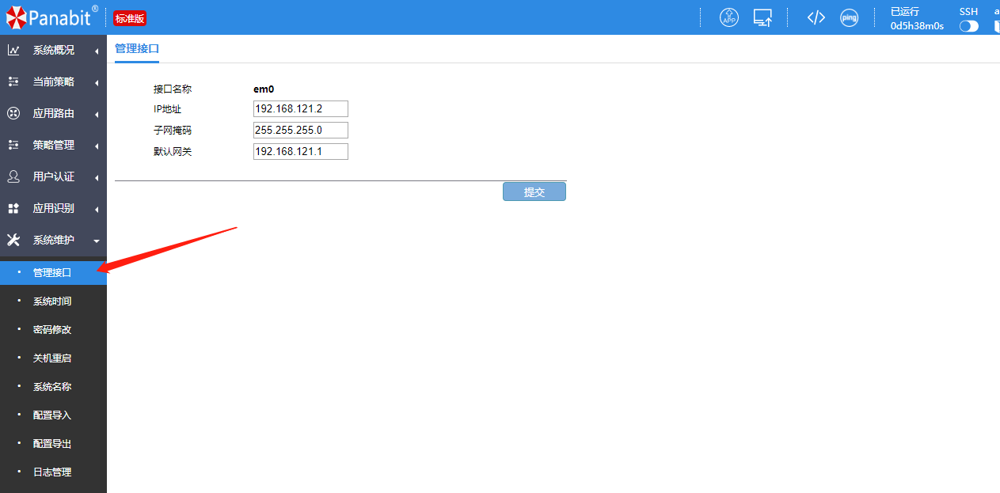
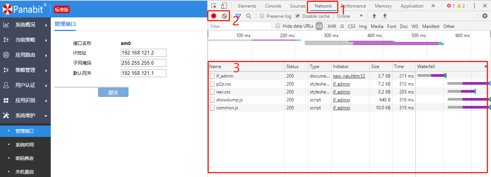
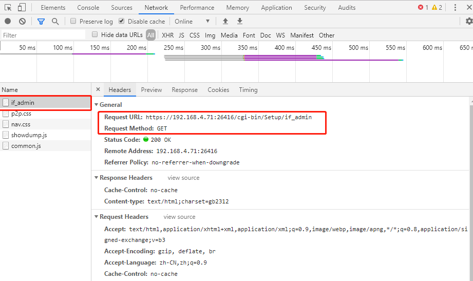
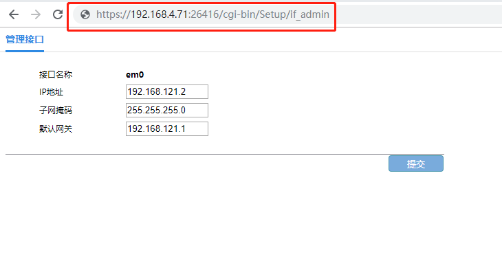
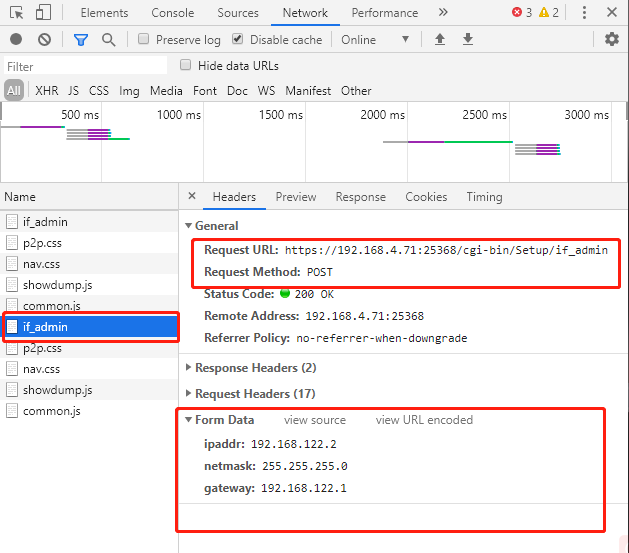
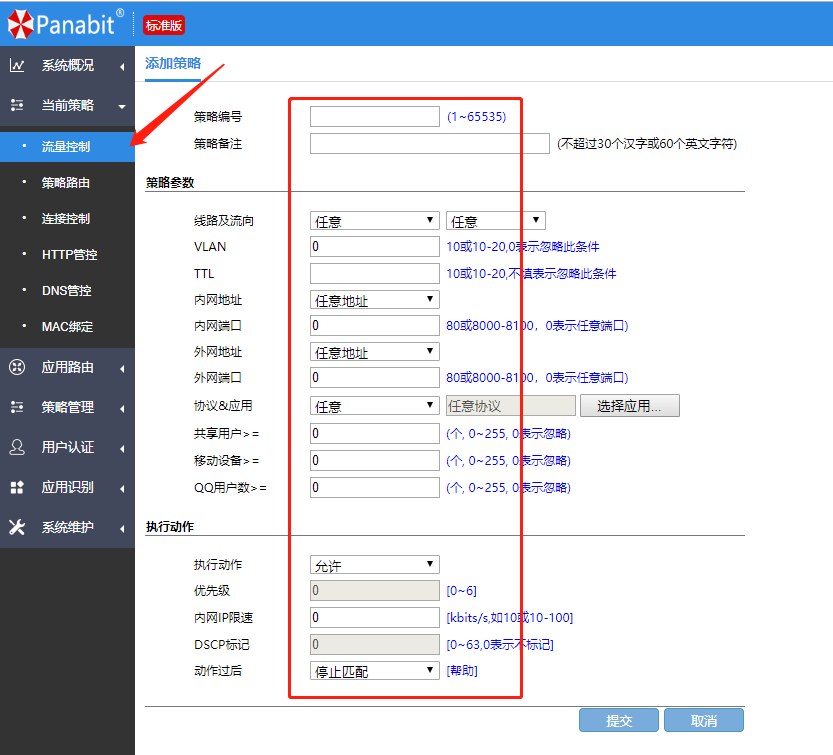
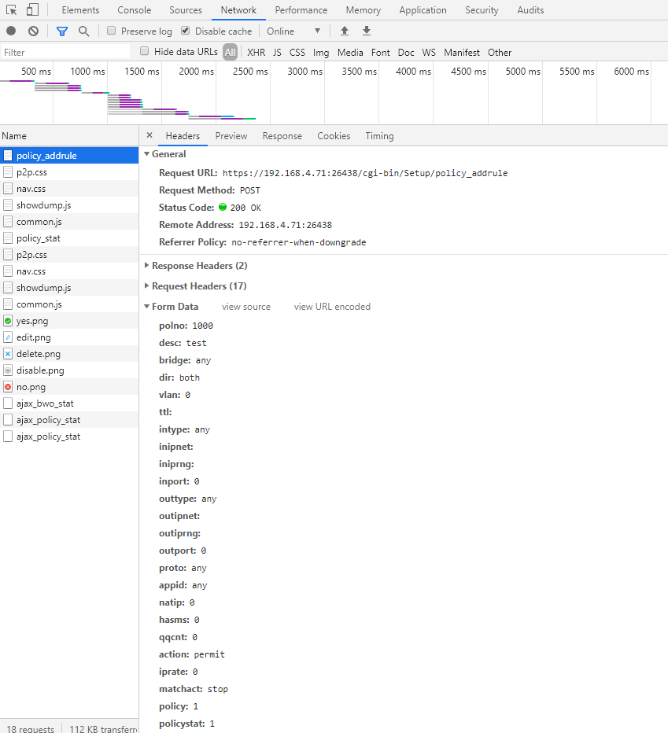
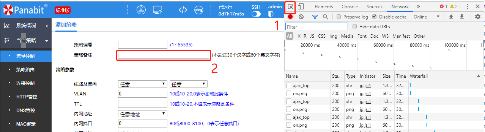
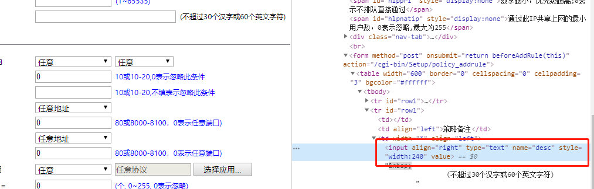

## woody

2019-10-30

###### chrome  版本 78.0.3904.70（正式版本） （64 位）

###### panabit标准版	 版本信息 NANBEI(南北朝)r1p8，20190819.124224

## 示例一：查看并修改panabit管理口接口

##### 使用chrome查看管理口地址

##### 按F12打开chrome控制台

1. 查看Network标签
2. 暂停Network信息的记录，清除当前记录
3. Network信息的记录

##### 在记录信息中查看if_admin，右侧**Request URL**为请求的地址，**Request Method**为请求的方法。

##### 对于没有参数请求方法为get的请求，可以直接通过浏览器访问

##### 在主页页面上，点击提交

##### 可以看到此时请求的地址**Request URL**并未发生变化，但**Request Method**请求方法，已经改为post，并且在最下面多出一列Form Date数据，里面的内容是本次提交的数据。

## 示例二：添加一条策略配置

#### 填写参数并提交

#### 在控制台中看到本次请求的地址和数据，如果不能确定参数对应的实际意义，可以使用控制台工具

1. 选择控制台工具
2. 点击需要填入的输入框

##### 在右侧会标亮一个\<input\>输入框，name标签对应内容对应提交数据的键，可以看出，提交是数据比需要填入的数据要多，因为有些数据被默认隐藏了，这样数据也是要我们处理提交的。提交的数据中没有赋值的，可以省略不提交。

tips：

1. 当控制台记录信息刷新太多，可使用上面介绍暂停记录的方法，及时清理控制台

2. 控制台中以.js，.css文件结尾的是页面加载需要的文件，可以忽略

3. 以ajax_开头的是异步加载数据的接口，里面数据可以提取记录

4. 本文只针对此系列的panabit版本，其他版本查找方法相同，接口地址可能发生了变化

   

