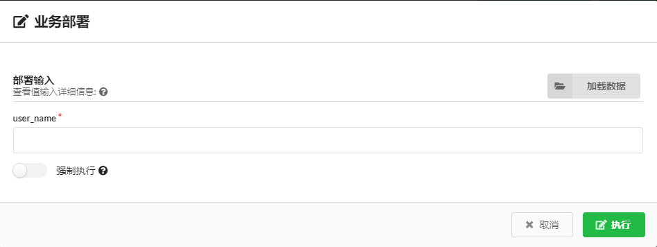

# 用户手册——功能介绍

| 服务版本 |        修订人        |  修订日期  |
| :------: | :------------------: | :--------: |
|  ucm1.0  | 季方伟（第一次修订） | 2019-10-31 |

[TOC]

# 一.概述

UCM提供了以下功能

1.查询设备状态

2.更改接口配置

3.接口查询

4.查询链路侧率

5.创建防火墙

6.创建用户账号

7.重置账号密码

8.创建网关用户组

9.创建qos规则

10.查询用户

11.链路查询

12.一键同步

# 二.安装

#### 安装（x86版）——ucm1.0

​	2.1 需求环境及安装准备:

| Centos7 | MINIMUM | RECOMMENDED |
| :-----: | :-----: | :---------: |
|  vCPUs  |    2    |      8      |
|   RAM   |   2GB   |     4GB     |
| Storage |   4GB   |    20GB     |

​		ucm1.0的tar包（厂家提供）

​	2.2 安装docker。

​		在新主机上首次安装Docker CE之前，需要设置Docker存储库。

​		 （1）安装所需的包。

        sudo yum install -y yum-utils \
        device-mapper-persistent-data \
        lvm2
​		 （2）使用以下命令设置稳定存储库。

        sudo yum-config-manager \
        --add-repo \
        https://download.docker.com/linux/centos/docker-ce.repo
​		 （3）安装最新版本的Docker CE和containerd

        sudo yum install docker-ce docker-ce-cli containerd.io
     如果提示接受GPG密钥，请验证指纹是否匹配
         060A 61C5 1B55 8A7F 742B 77AA C52F EB6B 621E 9F35，
     如果匹配，则接受该指纹 。

​		 （4）启动Docker。

        sudo systemctl start docker
​		 （5）通过运行hello-world 映像验证是否正确安装了Docker CE 。

```
    sudo docker run hello-world
```

 出现Hello from Docker 表示Docker安装成功

​	2.3 安装镜像，并启动容器。详细参考——《docker容器和镜像的打包.md》

<http://192.168.4.221:30000/zsk/doc/blob/master/%E5%B7%A5%E4%BD%9C%E6%96%87%E6%A1%A3/docker%E7%9A%84%E5%AE%B9%E5%99%A8%E9%95%9C%E5%83%8F/docker%E5%AE%B9%E5%99%A8%E5%92%8C%E9%95%9C%E5%83%8F%E7%9A%84%E6%89%93%E5%8C%85.md>

​	2.4推荐使用谷歌浏览器，在浏览器里输入          http://centos的ip地址        进入ucm界面

​	2.5登录账号密码 admin/admin

​	2.6搭建radius服务，参考地址——<http://192.168.4.221:30000/zsk/doc/blob/master/panabit/panabit%E5%AF%B9%E6%8E%A5radius.md>
    radius搭建在另一台centos机器上

​	2.7搭建panlog，参考地址——

<http://192.168.4.221:30000/zsk/doc/blob/master/%E5%B7%A5%E4%BD%9C%E6%96%87%E6%A1%A3/panlog/%E5%88%9B%E5%BB%BApalog.md>

​	2.8搭建panabit，参考地址——

<http://192.168.4.221:30000/zsk/doc/blob/master/panabit/panabit%E7%BA%BF%E8%B7%AF%E5%88%87%E6%8D%A2%E9%85%8D%E7%BD%AE%E6%B5%81%E7%A8%8B.md>

​	2.9panlog管理panabit，参考地址——

<http://192.168.4.221:30000/zsk/doc/blob/master/%E5%B7%A5%E4%BD%9C%E6%96%87%E6%A1%A3/panlog%E7%AE%A1%E7%90%86panabit/panlog%E7%AE%A1%E7%90%86panabit.md>

# 三.功能配置

### 1.查询设备状态

**查询步骤**：船端状态——》设备状态——》更新

可以查看到设备的：序号、网关ID、名称、状态、最后在线、有效期、用户、连接数、上行/下行（bps）、运行、温度/cpu、当前版本

状态分为online,adpoting,offline三种状态。

online为在线状态

adopting为上线中

offline为离线

.jpg)


### 2.接口配置

**更新步骤**：设备功能部署——》更新接口配置——》（输入参数）——》部署

.jpg)

部署中输入lan/wan的MTU值（一般为1500）

.jpg)


### 3.接口查询

**更新步骤**：设备功能部署——》接口查询——》更新

可以查看以下参数：

序号、线路名称、网卡、状态、ip地址、网络掩码、MTU、VLAN、流入速率、流出速率、网关id

.jpg)

.jpg)

### 4.链路策略

**更新步骤**：设备功能部署——》链路策略——》更新

序号、当前、用户组、源接口、VLAN、TTL（time to time生存时间）、源地址/端口、目标地址/端口、协议、应用、DSCP(Differentiated Services CodePoint	差分服务编码点)、用户类型、动作、目标线路、下一跳、状态

.jpg)

### 5.防火墙

.jpg)

**新增步骤**：设备功能部署——》防火墙——》新增——》（输入参数）——》部署

.jpg)

action：permit(允许),deny(阻止)

external_ip:外网ip，支持格式xxx.xxx.xxx.xxx/n和xxx.xxx.xxx.xxx-xxx.xxx.xxx.xxx，不区分IP的时候输入any

external_port:外网端口

internal_ip:内网ip，支持格式xxx.xxx.xxx.xxx/n和xxx.xxx.xxx.xxx-xxx.xxx.xxx.xxx，不区分IP的时候输入any

internal_port:内网端口

policy_id:策略编号，范围1~1000

protocol:协议，分为UDP,PPP,TCP,假如不区分可以写any

direction:in(下行),out(上行),both(双向)

**修改步骤**：设备功能部署——》防火墙——》（已经建好的策略的更新按钮）——》（输入参数）——》更新

.jpg)

**删除步骤**：设备功能部署——》防火墙——》（已经建好的策略的删除按钮）

.jpg)

### 6.新增用户账号

.jpg)

**新增步骤**：业务运营——》新增用户账号——》（输入参数）——》执行

.jpg)

groupname:必须填写已经存在的网关用户组

password:密码

user_name：用户名称

Max-Monthly-Session_value：每个月最大连接时间，单位是小时，没有范围

Max_Monthly_Traffic_value ：每个月最大连接流量，单位是M，没有范围

Max_all_session_value：这个账号所能使用的最大时长，单位是小时，没有范围

login_time_value ：格式是    00:00-00:00/00:00-00:00       (工作日/周末)

### 7.账号密码重置

.jpg)

**重置步骤**：业务运营——》账号密码重置——》（输入参数）——》执行



user_name：必须是已存在的用户。重置结果密码变为88888888

### 8.网关用户组

.jpg)

8.1创建无限制用户组

**创建步骤**：业务运营——》无限制用户组——》（输入参数）——》部署

无限制用户组上网速度没有限制，也没有上网行为限制

.jpg)

8.2创建高速上网用户组

**创建步骤**：业务运营——》高速上网用户组——》（输入参数）——》部署

高速上网用户组：上下行速率为1024kb，不能打游戏

.jpg)

8.3创建低速上网用户组

**创建步骤**：业务运营——》低速上网用户组——》（输入参数）——》部署

低速上网用户组：上下行速率为256kb，不能看电视，不能打游戏

.jpg)

8.4创建自定义用户组

**创建步骤**：业务运营——》自定义用户组——》（输入参数）——》部署

max_downlink_rate：最大下行速率

max_uplink_rate：最大上行速率

not_allowed_app ：不允许使用的规则（game,video,mobile,webmail），填入哪种，规则就禁用哪种。

user_group_name：组名称

.png)

8.5更改网关用户组

只支持更改自定义用户组

**修改步骤**：业务运营——》网关用户组——》自定义用户组后面的更新按钮——》（输入参数）——》更新

.jpg)

8.6删除网关用户组

**删除步骤**：业务运营——》网关用户组——》用户组后面的删除按钮

.jpg)

### 9.qos规则

.jpg)

**新增步骤**：业务运营——》新建QoS规则——》（输入参数）——》部署


.jpg)

direction：qos规则作用的线路方向，in（下行）、out（上行）、both（双向）。

ip_rate：内网限速，单位kbps。

 max_tcp_session：最大TCP连接数

max_udp_session：最大UDP连接数

max_total_session：最大总连接数

qos_rule_name：qos规则名字，任意字符。

wan_line：qos规则作用的wan线路名字。

**修改步骤**：业务运营——》qos规则——》已创建规则后的更新按钮——》输入参数——》更新

.jpg)

**删除步骤**：业务运营——》qos规则——》已创建规则后的删除按钮

.jpg)

### 10.用户查询（删除）

**更新步骤**：业务运营——》用户查询——》更新

**删除步骤**：业务运营——》用户查询——》操作一栏中的删除按钮

可以查看：账号、登录ip、登录时长、上传流量、下载流量、总流量、更新时间

.png)

### 11.链路查询

**查询步骤**：业务运营——》链路查询——》更新

可以查看：网关、名称、线路、状态、流入PPS、流出PPS、流入BPS、流出BPS、更新时间

.jpg)

### 12.一键同步

**同步步骤**：设备维护——》一键同步

点击同步按钮将会针对上线中的网关同步所有配置（包括：防火墙，qos，用户组，接口配置）。

.jpg)


# 四.常见问题（FAQ)

## 1.部署创建完之后，界面没有反应。

（1）进入主页，在部署中查找到新建的部署。

（2）查看部署状态，后面为绿色√，表明部署已经完成，刷新下界面即可。

（3）如果后面为蓝色X,表明工作流尚未执行。点击如图所示的install。

.png)


## 2.点击更新按钮，后台日志系统一直在打印，重试，停不下来。

（1）进入主页中的部署，找到相对应的部署名称

（2）点击那一条的左上角，点击Kill cancel

.png)


## 3.页面崩溃，刷新界面什么都没反应。

（1）进入centos，使用root权限

（2）输入

```
docker ps -a
```

.jpg)

可以看到容器状态（STATUS）为离线（Exited）

（3）输入

docker start （容器id前3位（CONTAINER ID))

```
docker start 990
```

.jpg)

（4）再次输入

```
docker ps -a
```

.jpg)

可以看见状态为 up

（5）再次进入浏览器输入centos的ip地址，就可以进入了。

（6）假如容器状态为up，但是输入ip地址还是进不去，这种情况是浏览器默认给ip地址前加上了https://了。

​        我们开放的是80端口，所以需要手动在浏览器地址栏里输入    http://(centos的ip地址)

***注意：现场实际情况下，容器 id会不一样，需要自己查看***


## 4.日志系统有什么用。

在日志系统中，可以查看到你在ucm所做的每一次有效点击，执行内容。

反馈用户执行信息，以及成功提示或失败提示。

.jpg)


## 5.其他问题

联系修订人
手机-18762492335