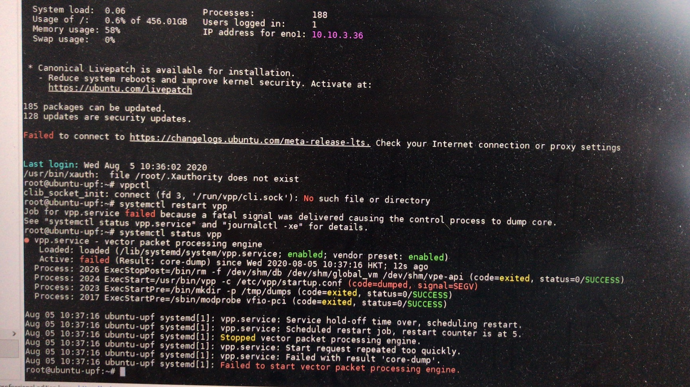
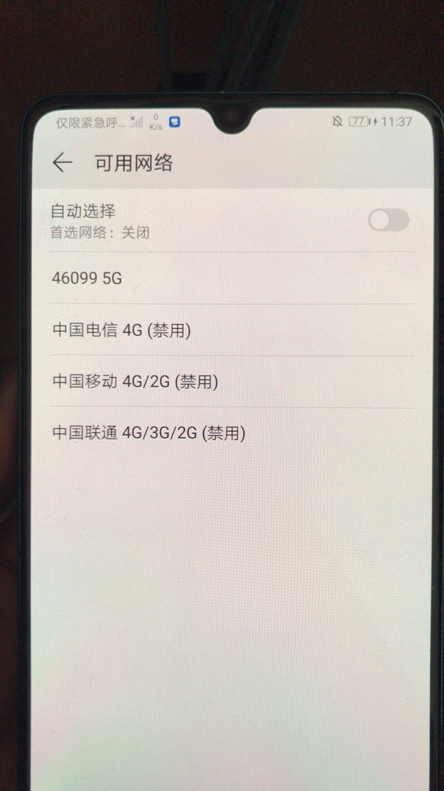

# 																														       											**工程故障报告**

| 项目名称     |                                |                  |          |
| ------------ | ------------------------------ | ---------------- | -------- |
| 提出单位     | 上海宽带技术及应用工程研究中心 | 关键客户         |          |
| 协调指挥人   |                                | 处理人员         |          |
| 故障开始时间 | 2020/8/4                       | 故障处理结束时间 | 2020/8/5 |
| 填报人       | 朱涛                           | 填报时间         | 2020/8/6 |

**故障现象**

​	故障1.upf无任何提示突然出现core-dump(之前可正常运行vpp服务),无法启动vpp服务，重启也无效果



​	故障2.配置没有任何改变，之前可以注册的手机突然不能注册，RRU不发射任何信号




**原因分析及解决方案**

```
故障1原因分析:upf软件系统存在bug，无法修复				
故障2原因分析:BBU不稳定，需要不断的修改配置文件进行调整才能正常运行				
				
故障1解决方案:重装ubantu系统，重装upf				
故障2解决方案:修改BBU配置文件/home/BaiBBU_SXSS/DU/cfg/TR196_gNodeB_DU_Data_Model.xml 的如
<SsbAbsoluteFreq>620928</SsbAbsoluteFreq>，<NRArfcnDL>633360</NRArfcnDL>，
<InitUlMcs>5</InitUlMcx>,<InitDlMcs>24</InitDlMcx>等参数后手机恢复正常注册			
```

​	
​				
​				
​				